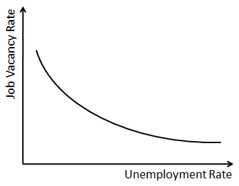
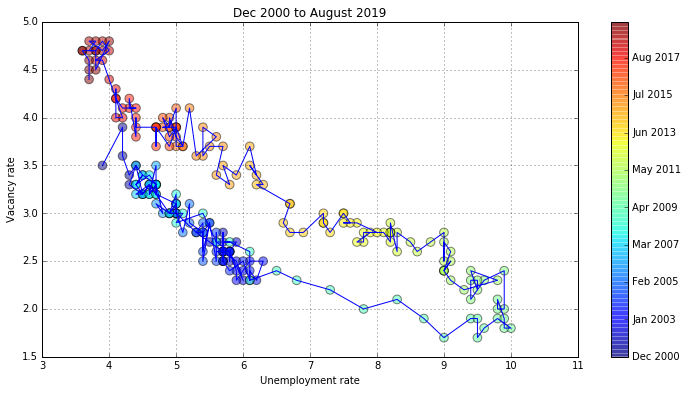
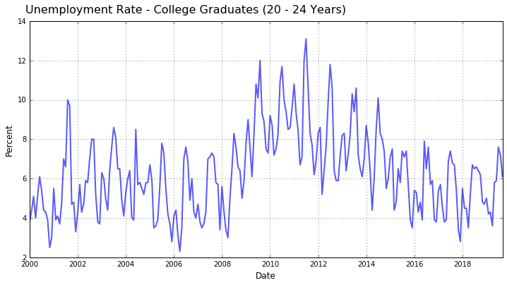

There's a lot of talks these days about an economic slow down that could potentially occur in the United States. If this is true, the evidence of this has yet to appear in the labor market. The BLS posted an unemployment rate of 3.5% for September 2019, down 0.2% from the previous month. The economy also created 136,000 jobs, which is slightly less than what was expected, previous months were revised upwards [[1](#1)].

It was initially assumed that the unemployment couldn't go much lower, due to something called NAIRU: the **Non-Accelerating Inflation Rate of Unemployment**. Without getting into deep economic theory, NAIRU (not to be confused with the natural unemployment rate) describes the level at which it would be difficult for the unemployment rate to decline, due to the inability of firms to attract new talent at the prevailing market wage.

As such, the only way to attract new workers would be to raise wages, which would force firms to rates prices to offset their cost, which would raise consumer prices overall. Are the historical lows of the unemployment rate evidence of further slack in the labor market?

## What does JOLTS tell us?

JOLTS, or the Jobs Openings and Labor Turnovers Survey, is another measure of labor utilization, similar to the establishment and population surveys of the BLS [[2](#2)]. The survey tracks job openings, hires, and total separations (whether voluntary or involuntary) of the labor force. The BLS reports JOLTS with a two-month lag, as opposed to the employment situation, which is reported with a one-month lag.

### Job Openings

Total job openings for August 2019 were reported at 7.05 million, which is lower the 7.34 million print during the same time a year ago. This brings the job openings rate to 4.4%.

### Hires

Total hires were reported at 5.77 million, again lower than the 5.82 million figure posted a year ago. The hires for August is 3.8%.

### Separations

Separations are reported in two different categories: quits and layoffs. The number of quits decreased in August to 3.52 million; however, still the highest level ever. At the same time, the number of layoffs was 1.78 million. Altogether, the number of separations for August is
5.63 million.

This brings the quits rate to 2.3%, the layoffs rate to 1.2%, and the total separations rate to 3.7%.

## Beveriedge Curve

Conventional economic wisdom tells us that there is an inverse relationship between the job openings rate and the unemployment rate. Why is this; shouldn't more employment generally lead to fewer job vacancies? This is not necessarily the case. Higher unemployment is usually associated with recessions, and when recessions occur, firms are less likely to expand their workforce; hence, a lower job openings rate. The relationship can be illustrated in what is known as **The Beveridge Curve**.

The Beveridge Curve plots the job openings rate with respect to the unemployment rate [[3](#3)]. During an expansion, the job openings rate is high, and the unemployment rate is low, which causes the curve to move towards plots upward and to the left. During a contraction, the job openings rate is low, and the unemployment rate is high, which causes a movement along the curve in the opposite direction.  Basic Econ 101, pretty much.

As we all learn in Econ 101, things become more interesting when we're dealing with *shifts* in the curve, which can indicate a structural change in the economy. This shift can be due to industry-based structural mismatching or geographical changes. If we examine the relationship between unemployment and job openings, this appears to be the case.

The following Beveridge Curve is one that I have created in python, using data from the Federal Reserve Economic Database (FRED), which was extracted through Quandl [[4](#4)] [[5](#5)].

It would seem that the curve started to shift around 2010, a couple of months after the end of the Great Recession. However, when the recovery started in 2009, the curve did not retrace the previous pattern from 2000-2009. What does this shift in The Beveridge Curve mean?

We can look back at a random period from nearly 20 years ago when the unemployment rate was near 4.0%. The job openings rate hovered around 3.0%. More than a decade later, the job openings rate increased to 4.5% with the same level of unemployment. So, for any level of unemployment (horizontal axis), there appears to be a higher rate of job openings (vertical axis).

More than 10 years after the Great Recession, employers seem to be reluctant to fill their job openings. Put it another way, it appears that employers are having a difficult time finding a match when posting job opportunities, whether internally or externally. Following periods of economic decline, it isn't uncommon to find high levels of unqualified candidates. This mismatch usually lasts about three years, on average, according to some research [[6](#6)].

As mentioned before, the unemployment rate is near historic lows. Who could possibly suffer from this structural shift?

## Your First Big Break After College

It should go without saying that college graduates do relatively well compared to those without a college degree. Also, people who graduate into a strong labor market are more likely to earn more through their careers than people who join the labor market during a recession. According to data from the New York Federal Reserve, the unemployment rate for recent college graduates is 3.8% [[7](#7)].

Also, the BLS shows that the unemployment rate for college graduates between the age of 20 - 24 is around 6.1%, which is nearly double the national average. As you can see from the following chart, the data is very noisy; dropping during the beginning of the year and rising towards the middle (usually the summer). This is because, as you can imagine, during the beginning of the year, students are actively enrolled in school, so they aren't counted as part of the labor market. Once they graduate (usually during the summer), they begin actively looking for work. From that point onward, recent graduates are officially counted among the unemployment statistics.

The real cause of concern may be the *underemployment rate,* which describes a situation where workers of high skill levels and high educational attainment are working in relatively low-skilled, low-wage jobs. This rate usually varies, but Gallup estimates that the underemployment rate is somewhere around 12.1% [[8](#8)]. This all ties into the shift in the Beveridge curve, and why employers are more reluctant to fill their job openings. But why is this the case? How do we know that the shortfall of recent college graduates has caused this shift?

### Entry-Level Not So Entry

A prevailing, and yet and unfortunately, Catch-22 persists in the labor market. Some firms won't hire you without the necessary (or related) experience; however, you'll never get the required experience if the firms aren't willing to take a chance on you. As our economy becomes more specialized and highly competitive, it would seem that this issue will continue to persist.  Some research conducted by Kushal Chakrabarti of TalentWorks has found that 61% of all entry-level jobs require 3+ years of experience [[9](#9)]? How can this be?

The process was rather simple. A random sample of 95,363 jobs was analyzed. From there, you can parse through the types of jobs being offered and the experience they require. Some interesting details were discovered:

- The amount of experience required for any position increases by 2.8% every year. At this rate, the graduating class of 2032 will need 4 years of experience just to get their first job.
- With those three years of experience, you will qualify for roughly 75% of all entry-level jobs being offered. An extreme difference from the labor market conditions of our parents, who could be eligible for most entry-level jobs with merely a college diploma.
- Very few of the entry-level jobs you'll find on websites such as LinkedIn or Indeed (LinkedIn is the largest culprit of this in my experience) are actually entry-level positions. These days, internships are considered the new entry-level job [[10](#10)].

So what gives? Why are so many firms trying to discourage recent college graduates from applying to what should be entry-level positions? Maybe recent college grads are just unprepared for the workplace. That certainly seems to be the view of most employers, according to a survey conducted by the National Association of College and Employers (NACE) [[11](#11)].

The results of this survey indicate that college graduates tend to overestimate their abilities when it comes to areas like professionalism, work ethic, oval/written communication, and critical thinking skills.

Whether this is true or not, the fact that employers believe this is true presents an obstacle for recent college grads. Today, employers are getting impatient, and they prefer workers who don't need to be trained to do their jobs. We can also come up with a plethora of other reasons for this disparity. Still, this issue is significantly related to the shift in The Beveridge Curve, a mismatch between the skills employers require the skills the workforce possesses.

## What Can Be Done, If It Should Be Done?

It's unclear what can be done about this structural change if there is anything at all that can be done about it. Is it unreasonable to ask employers to become more realistic about the job requirements for the jobs they offer? Should our universities start reducing the number of curriculums that are impractical and a waste of time? I don't have the answers to these questions; however, we do know that there is an evident labor market inefficiency that isn't going away. For whatever reason, employers are posting more job openings but don't like what they're seeing among possible candidates.

## Sources 

[1] [Bureau of Labor Statistics | Employment Situation](https://www.bls.gov/news.release/empsit.nr0.htm)

[2] [Bureau of Labor Statistics | Jobs Openings and Labor Turnovers Survey](https://www.bls.gov/news.release/pdf/jolts.pdf)

[<a name="3">3</a>] [Wikipedia | The Beveridge Curve](https://en.wikipedia.org/wiki/Beveridge_curve)

[<a name="4">4</a>] [Federal Reserve Economic Database (FRED)](https://fred.stlouisfed.org)

[<a name="5">5</a>] [Quandl | The world's most powerful database](https://www.quandl.com)

[<a name="6">6</a>] [Richmond Federal Reserve | Help Wanted: Employers are having a hard time hiring. Not enough workers or not the right skills?](https://www.richmondfed.org/publications/research/econ_focus/2018/q3/feature1)

[<a name="7">7</a>] [Federal Reserve Bank of New York | Unemployment Rates for College Graduates and Other Groups](https://www.newyorkfed.org/research/college-labor-market/college-labor-market_unemployment.html)

[<a name="8">8</a>] [SmartAssets | How many Americans are Underemployed](https://smartasset.com/retirement/how-many-americans-are-underemployed)

[<a name="9">9</a>] [TalentWorks | The science of the job search - Part III](https://talent.works/2018/03/28/the-science-of-the-job-search-part-iii-61-of-entry-level-jobs-require-3-years-of-experience/)

[<a name="10">10</a>] [Washington Post | Are internships the only way for recent college grads to grab entry level jobs](https://www.washingtonpost.com/news/grade-point/wp/2015/05/18/are-internships-the-only-way-for-recent-college-grads-to-grab-entry-level-jobs/?noredirect=on)

[<a name="11">11</a>] [National Association of College and Employers | Job Outlook: Fall recruiting for the class of 2018](https://www.naceweb.org/job-market/trends-and-predictions/job-outlook-fall-recruiting-for-the-class-of-2018/)