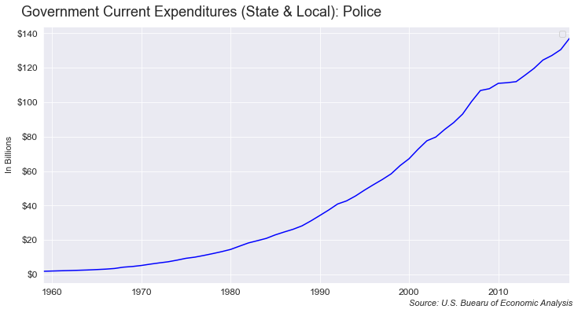
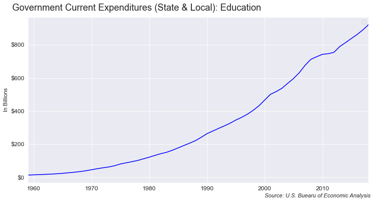
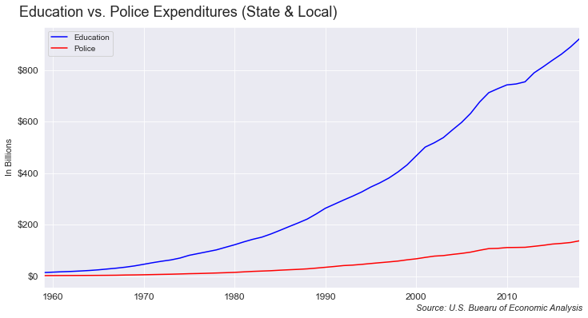
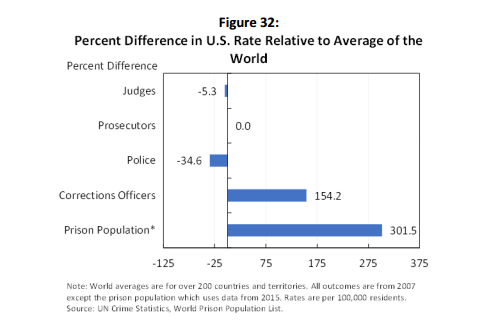

You may not believe it, but it's true. We currently already spend, on aggregate (at the state and local level), more on teachers and education more than we spend on police and law enforecement. But who says we aren't, and why does this matter?

I give you Exhibit A:

<!--  -->

Here, we have the anatomy of a viral tweet: an emotional platitude, factually inaccurate, and a rallying cry to address a problem that currently does not exist. To be fair, maybe Benjamin Dixon is trying to tell us what we should NOT be doing. As in, we should NOT get to a point where we are funding Police more than Teachers.

I think that's fair, and most people would agree with that. As a thought experiment, I decided to look at economic statistics to analyze the ratio of the levels we're spending on Police relative to Teachers. So, as usual, I took to Python [[1](#1)].

So the output of our code is the historical Government Current Expenditures at the state and local level of law enforcement. This data goes back to 1959. As of 2018, we currently spend 137 billion dollars on police [[2](#2)]. (Note: much of these data comes from FRED, although it sourced by the BEA)

In 1960, we were spending ~2 billion dollars on police. That's is a 6,750% increase in 60 years. Faster than the rate of inflation last time I checked. That's a lot.

Has spending on Education managed to keep the same pace?

Well, this plot looks the same as the police expenditures plot, but the y-axis is ten times larger.

Maybe we should place both time series on the same plot so we can see what's really going on.

It certainly doesn't look like we're spending more on Police than we are on Teachers. Not anywhere close. Based on what I'm looking at, what we spend on law enforcement is significantly dwarfed by the amount we spend on education (as it should be).

So why does this narrative persist? Why do people believe that we're not spending enough on education? I give you Exhibit B:

<!--  -->

There is this interesting perception among the #defundthepolice proponents is that Americans should be spending more on social services (including education), and the only reason we can't do that is because so much of current government expenditures is already allocated towards law enforcement.

As you can see from the meme above, the police take up a large portion of the budget. The reduction in funding for police would naturally be offset by other government programs, such as Housing, Education, Health Care, reinvestments, etc.

Sure, a reduction in police spending *would* increase spending for other things; however, we already spend significantly more on other things relative to the police.

We should indeed be spending more on all of the things that would probably reduce crime. However, there is currently nothing preventing us from doing this, especially not the police. If you compare the United States to Europe, we find that most European countries are more generous with welfare and social spending. However, this doesn't have anything to do with how much they spend on police.

As President Obama's Council of Economic Adviser pointed out, while the United States has more correctional officers and far more prisoners than the average country, it has 35 percent fewer police officers [[3](#3)].

The current problem with our relationship with police in society is that they're too unaccountable, have too much job security, and have far too little training. In fact, I would argue that that in order for police to recieve more training, they need *more* funding, not less. 

As state and local governments take steps towards reducing the level of funding from their law enforcement, we can expect the fewer people employed in these fields. Violent crime is currently at a 50 year low. One could make the argument, given this trend, that we no longer need the amount of police in our society.

However, if one is going to argue that police have no role in maintaining safe streets, they're also arguing against lots of strong evidence. One of the most robust, most uncomfortable findings in criminology is that putting more officers on the street leads to less violent crime [[4](#4)][[5](#5)][[6](#6)][[7](#7)][[8](#8)].

## Sources

[<a name="1">1</a>] [Stephanie Wu | Replicating the data from this post](https://github.com/SocraticallyStephanie/Economics/blob/main/Research/Police%20vs%20Teachers%20Spending.ipynb)

[<a name="2">2</a>] [Federal Reserve Economic Database (FRED)](https://fred.stlouisfed.org/)

[<a name="3">3</a>] [Obama White House (2016)  | Economic Perspectives on Incarceration and the Criminal Justice System](https://obamawhitehouse.archives.gov/sites/whitehouse.gov/files/documents/CEA%2BCriminal%2BJustice%2BReport.pdf)

[<a name="4">4</a>] [Klick & Tabarrok (2005) | Using terror alert levels to estimate the effect of police on crime](https://mason.gmu.edu/~atabarro/TerrorAlertProofs.pdf)

[<a name="5">5</a>] [Klick, MacDonald, & Grunwald (2015) | The effect of private police on crime: evidence from a geographic regression discontinuity design](https://www.law.upenn.edu/live/files/8949-179jrss831pdf)

[<a name="6">6</a>] [Mello (2018) | More COPS, Less Crime](https://mason.gmu.edu/~atabarro/TerrorAlertProofs.pdf)

[<a name="7">7</a>] [MacDonald, Fagan, & Geller (2016) | The effects of local police surges on crime and arrest in New York City](https://journals.plos.org/plosone/article?id=10.1371/journal.pone.0157223)

[<a name="8">8</a>] [Rosenfeld (2013) | Focusing police efforts on "hot spots" reduces crime - and can prevent it, too](https://scholars.org/sites/scholars/files/ssn_basic_facts_rosenfeld_on_hot_spot_policing.pdf)

