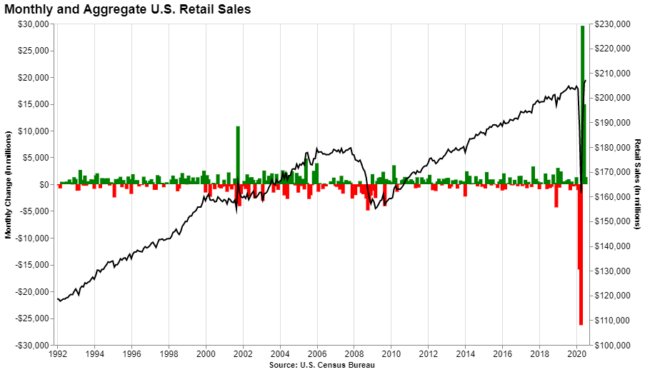
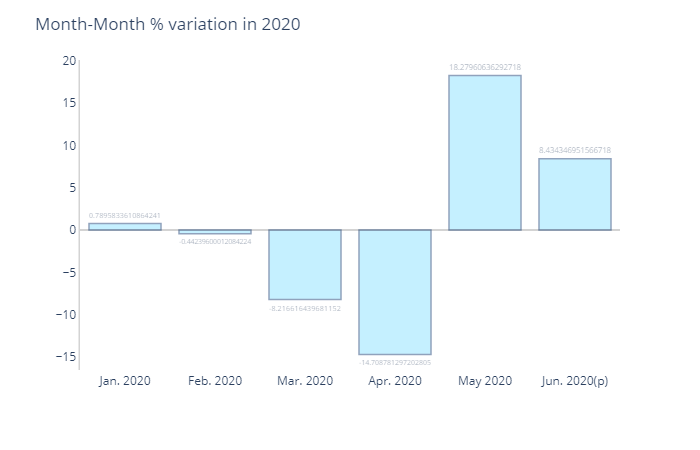
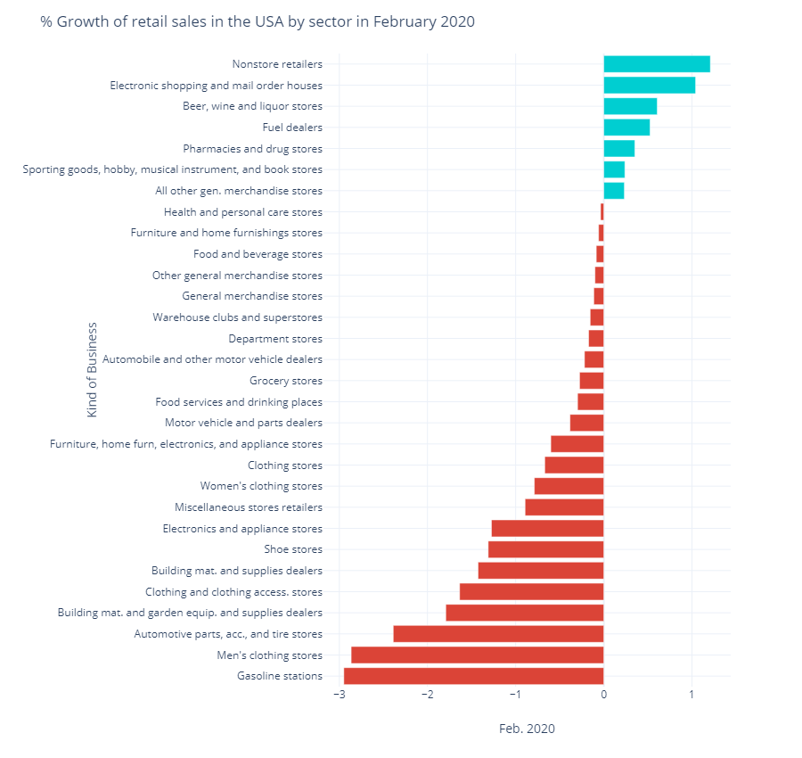
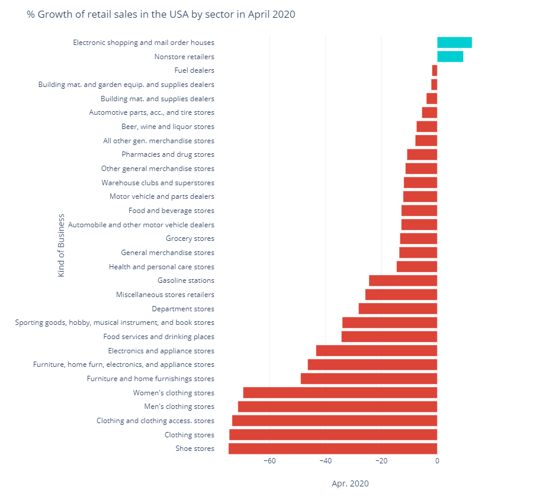
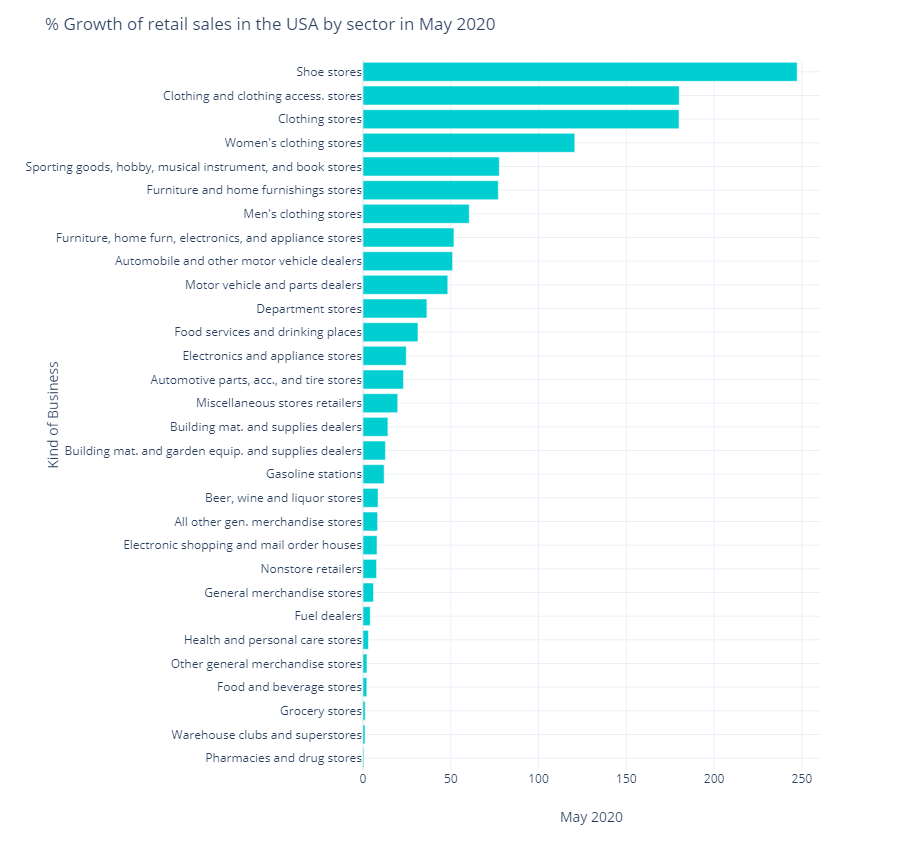
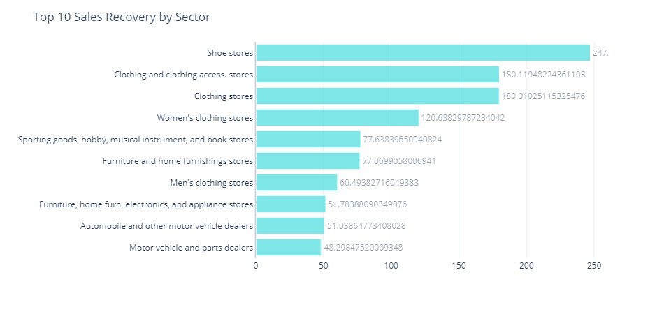
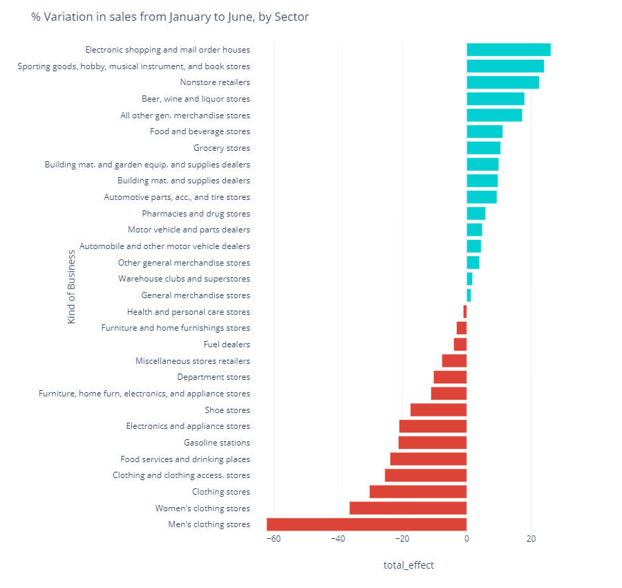
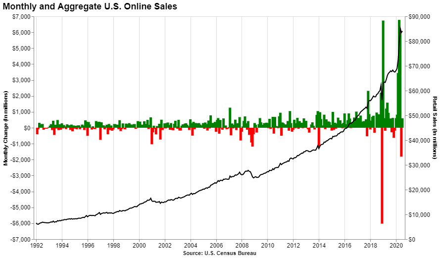

It doesn't take a genius to know that 2020 has been a year for the United States economy. Tens of millions were encouraged or forced to remain indoors in an attempt to slow the spread. Only a few industries/businesses were allowed to stay open, as they were classified as "essential businesses." The longest expansion in U.S. history came to an end in Q1 2020, which resulted in a -5.0% contraction in economic activity (followed by a -32.9% drop in Q2).

Within the same period, retail sales declined -0.87% YoY for Q1 2020, equating to a ~5 billion drop. During the second quarter, sales dropped a whopping 8.16% YoY, resulting in an approximately 12 billion decline in retail sales. (although the quarterly decline in sales is the largest since the Great Recession, the monthly decline is the largest in history)

However, during the last two months, retail sales have recovered to pre-recession levels, and total sales are the highest.

As everyone across the country is adjusting to a life with COVID, it's interesting to see which industries benefit the most, and which industries are the most impacted. The Census Bureau publishes data on Advanced Monthly Sales for Retail and Food Services; statistics are gathered utilizing a stratified random sampling method that tracks approximately 5,500 retail and food service firms. The data is then weighted and benchmarked to represent a complete universe of over three million retail and food service firms. The data goes as far back as 1992.

We saw a slight decline in February, which can be seen as a result of seasonality (a decline as a result of holiday shopping MoM). However, during the two months afterward, we've experienced some extreme declines in retail sales, most of which occurred in April. Most states haven't instituted their lockdowns until the end of March or the beginning of April.

## Retail Sales Pre-Lockdown

In February 2020, retail sales declined -0.44% MoM. The only industries which experienced growth were general merchandise, sporting goods/hobby stores, pharmacies/drug stores, fuel dealers, beer/liquor stores, electronic retail, and nonstore retailers. Nonstore retailers are essentially any business the primarily sells merchandise online, the industry with the largest monthly growth of 1.2%. 

The most significant declines include gasoline stations (-2.95%), men's clothing stores (-2.86%), automotive parts (-2.38%), general clothing stores (-1.8%), and building material/suppliers dealers (-1.63%). Out of 30 NAICS industries, just seven experienced sales growth for the entire month of February.

## Retail Sales Post-Lockdown

In April 2020, retail sales declined -14.7%; just two industries are experiencing growth during the lockdown: electronic shopping/mail-order houses and nonstore retailers. To be expected, as non-essential businesses are forced to close down, and people are encouraged to work from home if they are able. Social distancing policies instituted by state and local governments fueled demand for products designed to help people work from home and keep in contact with loved ones, such as computers, webcams, desks, monitors, etc.

One would also assume that industries such as grocery and fast food would see some growth during this period, considering these are classified as essential businesses. However, grocery and fast food industries experienced a -13.37% and -34.32% decline, respectively. This decline could be attributed to safety concerns (unable to implement the necessary infrastructure to continue operating safely). It could be due to the decrease in mobility (many of the food and drinking places include restaurants and bars, which people can no longer patronize).

Whatever the reason, it's pretty clear that both of these industries took a subtaintial hit. There is a reason why the Paycheck Protection Program (PPP) allowed even large resturant chains to recieve loans, despite the program being designed specifically for small businesses.

For the most part, the United States is a service-oriented economy. Fewer people moving around generally implies fewer money-making opportunities for businesses, regardless of industry.

## Retail Sales After Reopening

Although "reopening" is a somewhat subjective term at this point, we can say that relative to the initial lockdowns, most states have started to liberalize their economies. Like Florida, most states lifted its lockdown at the beginning of May, while others such as New York and New Jersey waited until the beginning of June. Some states, such as South Dakota, never instituted a lockdown at all. As such, we can spot the growth of the recovery at the exact movement states began to reopen.

During May, Retail sales grew 18.27%, which shouldn't be surprising to anyone if you shut down the economy for nearly two months. Also, every industry experienced sales growth, which also shouldn't be surprising. If you're at rock bottom, the only place left to go is up.

The top 5 industries with the most growth in May include shoe stores, clothing accessories, clothing stores, women's clothing, and sporting goods. An obvious explanation would consist of the resurgence of warmer weather. People are forced to remain inside, and it's challenging to keep doing in a more temperate climate. Plenty of clothing stores also reopened just in time for the summer season; so the surge in sales also coincides a change in climate.

A not so obvious explanation would include a change in habits such as eating and exercising. Being forced to remain indoors, we're probably eating more than usual and not exercising as often (considering the gyms are closed). Combined with all of the stress that everyone is going through, people are most likely gaining more weight. As such, they are probably shopping for clothes that fit or making adjustments to a current wardrobe.

## The Most COVID-Proof Industries

In the investing world, it's crucial to find industries that are "recession-proof." Finding industries that are immune to pandemics, COVID in particular, is especially tricky. We want to figure out which industries performed the best ( or worse) during the first half of 2020. For this, we're going to calculate the percentage change from January to June.

So if you were in the business of selling electronics and sporting goods, you most likely saw a lot of business. Interestingly, people have pointed out that liquor stores are not an essential business but noticed they were exempt from many shelters in place orders. There are most likely technical reasons for this (alcohol is still technically food), historical reasons (the prohibition era), and personal reasons (it helps reduces stress).

If you owned a department store, a place where clothing and general appliances were sold, or if you owned a bar/restaurant, you most likely lost a lot of money. This is understandable; if you want to prevent the spread of a deadly virus, then you're not going to keep places where people have to be within close proximity open.

As such, we see a temporary bifurcation of the retail market. For as long as we are following CDC safety guidelines, only industries that are considered the most "safe" and essential will outperform. If your business requires people to travel, be near one another, and require physical inventory, these industries will most likely take a hit until we've controlled the spread of this virus.

On the other hand, we need consider the possibility that some of the businesses that were forced to close may never repoen.

Although the current situation has made the traditional way of engaging in commerce inconvenient, plenty of businesses have found ways to accommodate their customers (such as no-contact delivery). These days, it doesn't hurt to have an online presence. 

