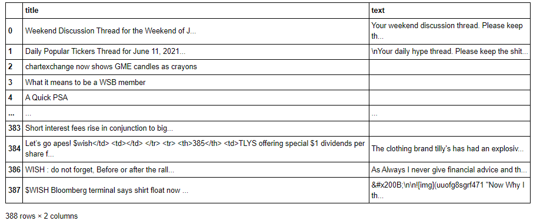
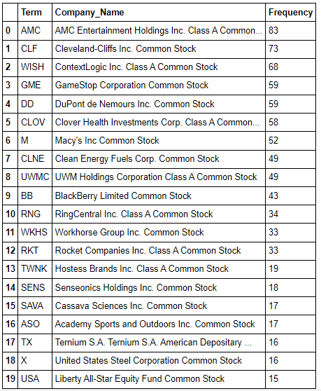

One of the most bizarre David vs. Goliath scenarios in modern finance, by far, belongs to the retail investors from Reddit's r/WallStreetBets versus Hedge Fund space. The story became such a fad that it garnered the attention of Treasury Secretary Janet Yellen and the SEC. With the democratization of finance, everyone can invest in markets once thought unobtainable to the common man.

## r/WallStreetBets vs. Wall Street Hedge Funds

The mania revolves around the most shorted stocks, shorted by hedge funds that hoped to make a killing when those stocks collapse. For anyone unfamiliar with how short selling works, the art of short selling involves a hypothesis that an asset price will fall within a given time frame. The process consists of an investor borrowing a stock, selling the stock, and then buying the stock back to return to the lender (hopefully at a lower price than what the investor initially purchased).

Where do hedge funds fit into all of this? Well, a bunch of hedge funds decided to get into the business of shorting equities with the highest short-interest. (The number of shares that have been sold short but have not yet been covered or closed out) At one point, the short interest of GameStop shares was over 140% of the float. If institutional investors wanted to close out their positions, they would need to buy those shares. But who is going to sell them those shares?

The folks over at r/WallStreetBets have discovered that stocks with small float are the easiest to manipulate if enough people got together. They also figured out that stocks that were massively shorted and didn't have many sellers left could be driven up to the point where investors would panic-buy to cover their short position. That panic buying would trigger a massive surge in GME's price, which could wipe out those hated Hedge Funds.

Since then, stocks such as GME, along with plenty of others, have been dubbed what we in the business call "Meme Stocks." A meme stock is basically the equity belonging to any publicly traded company where the stock has increased in value, not because of the company's performance fundamentals, but purely based on the attention the stock is receiving on social media (namely r/WallStreetBets). I'm not entirely sure which stocks are considered "memes" (there is actually an index which tracks these types of equities), but I know that this list would comprise of companies such as AMC Entertainment Holdings (AMC), Bed Bath and Beyond (BBBY), and Blackberry (BB) [[1](#1)].

Now that the mania has passed, GME sits at around $180 per share. I once remember a single day of trading, GME opened at 191; surged to a high of 255; crashed to a low of 173, and still managed to close at 188 per share. Totally normal behavior for a stock. Since then, the price has stabilized at around the 150-180 price range.

What does this mean for GME? Does this imply that r/WallStreetBets have moved on to the next oversold stock?

## Getting the Information from Reddit

I began by navigating to r/WallStreetBets. My original plan was to build this similiar to the news media webscraper algorithm for a data science project that I've done [[2](#2)]. One of the issues with using that algorithm is being able to infinitely scrolling reddit and scraping the new information.

Rather than using pagination to reveal additional results, Reddits makes an async call to fetch additional posts as you scroll down the page. This means that when we make our requests, we'll be able to scrape data from the ~20 or so posts but won't access additional data by requesting the next page.

However, there is a workaround that I've found to access the data I need: **PRAW**. PRAW stands for Python Reddit API Wrapper. PRAW is an api that allows you to easily read and write data to the website. To use it, you need to create the app credientials via Reddit and retrieve the `client_id` and `client_secret`.

Also, we're going to need a list of all publicly traded US stocks and their ticker symbols, so the script will know which strings (or text) to match. The NASDAQ website allows you to download a list from the major US exchanges, such as the New York Stock Exchange, American Stock Exchange (I didn't realize this was still a thing), and of course, NASDAQ [[4](#4)].

The NASDAQ screener covers micro and nano-cap equities (the stock of companies with less than 300 million dollars in market capitalization); it covers the equities of companies of different regions; it even covers American Depository Receipts (or ADRs for short).

## Scraping Reddit via PRAW

Getting the information from via involves 3 easy steps:

1. Getting content from r/WallStreetBets
2. Analyzing word frequencies
3. Inner joining word frequencies with stock tickers

```python
import pandas as pd
import praw
import re
import requests

reddit = praw.Reddit(
    client_id="YOUR CLIENT ID",
    client_secret="YOUR CLIENT SECRET",
    user_agent="Mozilla/5.0 (Windows NT 10.0; Win64; x64) AppleWebKit/537.36 (KHTML, like Gecko) Chrome/90.0.4430.212 Safari/537.36"
)
```
PRAW is actually easy to work with. PRAW stands for Python Reddit API Wrapper, which allows you to easily read and write data to the website. You start out by configuring an instance of Reddit, which requires the `client_id` and `client_secret` we'll you'll set up your authorized applications [[3](#3)].

The API also requires something called a "User Agent." A user agent is a line of text that helps servers' identify who is requesting information from the website hosted on their server. Any popular user agent will do; however, you can find out your user agent by simply asking Google. The script shows precisely what yours should look like.

```python
df = []

for post in reddit.subreddit('wallstreetbets').hot(limit=1000):

    content = {
        "title": post.title,
        "text": post.selftext
    }

    df.append(content)

df = pd.DataFrame(df)
```
The dataframe will end up looking like the following code block. In the first column, we have the title of the post; in the second, we have the text that encompasses the post.



The query only returned 388 rows of information, although we requested at most 1,000 post. This is because reddit has removed queries based on time and only allows reddit users to browse based on the most recent post. 388 post, while limiting, is also more than enough to extract the information that we need.

Now we need to analyze the data, which is the most complex part of the script. We'll need to use some regular expressions, which will allow python to check a specific sequence of characters to match or find a set of strings, in our case, tickers or the company names. Python has a native package for this, know as `re`.

We will loop through our data frame and utilize a key/value pair while iterating in this process. The key will be the words we are looking for in the post, while the value will be the frequency of the number of times certain words (in this case, tickers or companies) appear in each post. While we are doing this, we will also disregard the use of commonly-used terms, or filler words, in each of the posts. For those familiar with the Natural Language Processing techniques we used for analyzing media bias, the method is somewhat similar. [[5](#5)]

```python
regex = re.compile('[^a-zA-Z ]')
word_dict = {}

for (index, row) in df.iterrows():
    # titles
    title = row['title']

    title = regex.sub('', title)
    title_words = title.split(' ')

    # content
    content = row['text']

    content = regex.sub('', content)
    content_words = content.split(' ')

    # combine
    words = title_words + content_words

    for x in words:

        if x in ['A', 'B', 'GO', 'ARE', 'ON', 'IT', 'ALL', 'NEXT', 'PUMP', 'AT', 'NOW', 'FOR', 'TD', 'CEO', 'AM', 'K', 'BIG', 'BY', 'LOVE', 'CAN', 'BE', 'SO', 'OUT', 'STAY', 'OR', 'NEW', 'RH', 'EDIT', 'ONE', 'ANY']:
            pass
        elif x in word_dict:
            word_dict[x] += 1
        else:
            word_dict[x] = 1

word_df = pd.DataFrame.from_dict(list(word_dict.items())).rename(
    columns={0: "Term", 1: "Frequency"})
```
In the final step we will simply create a frequency table that counts the number of times a certain stock has appeared in a recently created reddit post. For this you should be using the csv you have saved from the NASDAQ stock screener website. The results are listed in the following data frame.

```python
stonks_df = pd.merge(ticker_df, word_df, on="Term")
stonks_df = stonks_df.sort_values(
    by="Frequency", ascending=False, ignore_index=True)
stonks_df
```


It's interesting to see Macy's on this list, considering that the retailer is practically on its deathbed (although, I did write about how clothing accessories and apparel have experienced the largest sales growth post-lockdown, so maybe not) [[6](#6)]. 

Macy's doesn't appear to involve the same factors that sparked the AMC/GME buying frenzy -- vigorously pumping up stocks for companies that are relatively undervalued by the market -- doesn't necessarily apply to all stocks that have piqued the interests of r/WallStreetBets. Of course, you can't be considered "day-traders" if there is a rhyme or reason as to why you make certain trades by not others.

As a "sophisticated investor," you may be wondering why I would be interested in the chatter of a retail trader platform such as r\WallStreetBets? It's true; our markets and investment philosophies do not converge. However, this information is vital for a much large project that I plan on conducting within a year or so.

I don't really have a dog in this fight (although, in full disclosure, I am bearish on GME). Still, this information serves as documentation, either for those who seek vindication for being right (on an investment strategy or stock pick) or those who seek to scrub away their awful track records.

[<a name="1">1</a>] [Associated Press | 'Meme stocks' go mainstream: There's now a fund for that](https://apnews.com/article/meme-stocks-buzz-fund-wall-street-c1b1086d9b4de2e69a9c790c97dd10e6)

[<a name="2">2</a>] [Kidquant | Analyzing News Articles With Python](https://kidquant.com/project/analyzing-news-articles-python/)

[<a name="3">3</a>] [Reddit | Develop your Reddit Application](https://www.reddit.com/prefs/apps)

[<a name="4">4</a>] [NASDAQ | Stock Screener](https://www.nasdaq.com/market-activity/stocks/screener)

[<a name="5">5</a>] [KidQuant | Analyzing New Articles With Python](https://www.nasdaq.com/market-activity/stocks/screener)

[<a name="6">6</a>] [KidQuant | Analyzing the Impact of COVID-19 on Retail](https://kidquant.com/post/2020-08-15-covid-impact-retail-sales/)