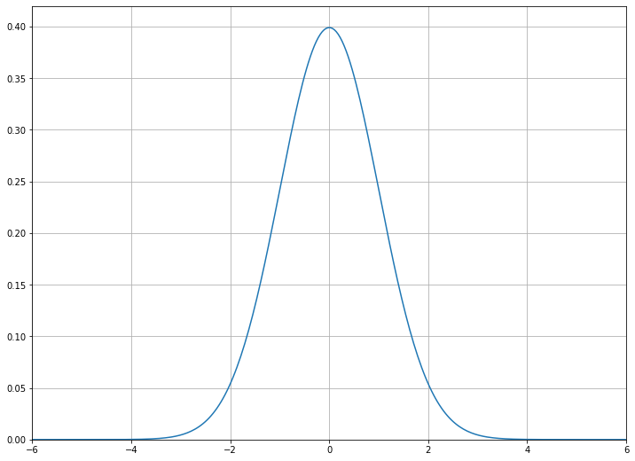
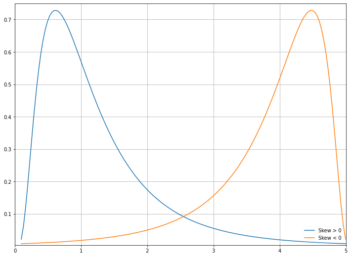
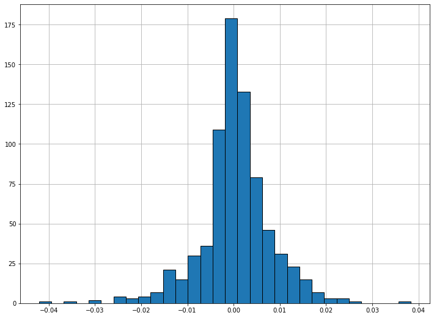
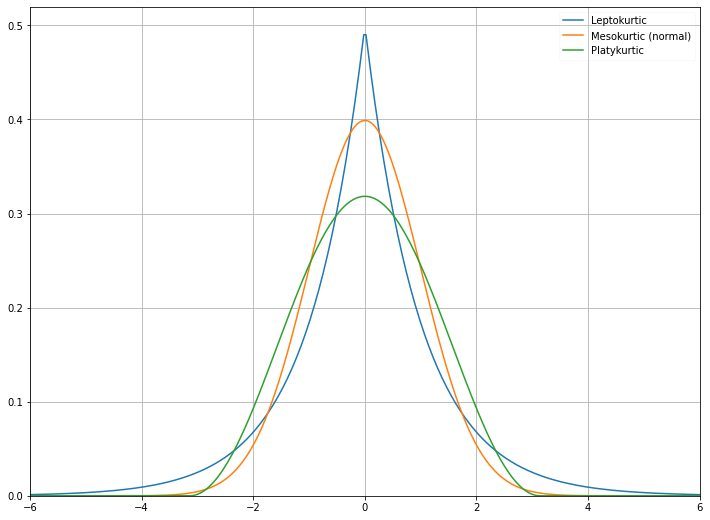

Sometimes mean and variance are not enough to describe a distribution. When we calculate variance, we square the deviations around the mean. In the case of large deviations, we do not know whether they are likely to be positive or negative. This is where the skewness and symmetry of a distribution come in. A distribution is symmetric if the parts on either side of the mean are mirror images of each other. For example, the normal distribution is symmetric. The normal distribution with mean, $\mu$, and standard deviation, $\sigma$, is defined as

$$f(x)=\frac{1}{\sigma\sqrt{2\pi}}e^{-\frac{(x-\mu)^{2}}{2\sigma^{2}}}$$

Plotting the distribution gives us the following:

```python
import matplotlib.pyplot as plt
import numpy as np
import matplotlib.pyplot as plt
import numpy as np
import scipy.stats as stats

# Plot a normal distribution with mean = 0 and standard deviation = 2

plt.figure(figsize=(12,9))
xs = np.linspace(-6,6, 300)
normal = stats.norm.pdf(xs)
plt.plot(xs, normal);
plt.grid()
plt.xlim(-6,6)
plt.ylim(0,.42)
```


A distribution which is not symmetric is called skewed. For instance, a distribution can have many small positive and a few large negative values (negatively skewed) or vice versa (positively skewed), and still have a mean of 0. A symmetric distribution has skewness 0. Positively skewed unimodal (one mode) distributions have the property that mean > median > mode. Negatively skewed unimodal distributions are the reverse, with mean < median < mode. All three are equal for a symmetric unimodal distribution.

The explicit formula for skewness is:

$$S_{K}=\frac{n}{(n-1)(n-2)}\frac{\sum_{i=1}^{n}(X_{i}-\mu)^{3}}{\sigma^{3}}$$

when $n$ is the number of observations, $\mu$ is the arithmetic mean, and $\sigma$ is the standard deviation. The sign of this quantity describes the direction of the skew as described above. We can plot a positively skewed and a negatively skewed distribution to see what they look like. For unimodal distributions, a negative skew typically indicates that the tail is fatter on the left, while a positive skew indicates that the tail is fatter on the right.

```python
plt.figure(figsize=(12, 9))
xs2 = np.linspace(stats.lognorm.ppf(0.01, .7, loc=-.1), stats.lognorm.ppf(0.99, .7, loc=-.1), 150)

# Negatively skewed distribution
lognormal = stats.lognorm.pdf(xs2, .7)
plt.plot(xs2, lognormal, label='Skew > 0')

# Positively skewed distribution
plt.plot(xs2, lognormal[::-1], label='Skew < 0')
plt.legend(framealpha=0.1, loc='lower right');
plt.ylim(.004, .75)
plt.xlim(0, 5)
plt.grid()
```



Although skew is less obvious when graphing discrete data sets, we can still compute it. For example, below are the skew, mean, and median for S&P 500 returns 2018-2020. Note that the skew is negative, and so the mean is less than the median.

```python
end = datetime.date(2018,1,1)
beg = end - relativedelta(years = 3)
pricing = pd.DataFrame(yf.download('SPY', start=beg, end=end))['Adj Close']

returns = pricing.pct_change()[1:]

pricing
print('Skew:', stats.skew(returns))
print('Mean:', np.mean(returns))
print('Median:', np.median(returns))


fig, ax = plt.subplots(figsize=(12,9))
plt.hist(returns, 30, edgecolor='black');
ax.grid()
ax.set_axisbelow(True)
```


## Kurtosis

Kurtosis attempts to measure the shape of the deviation from the mean. Generally, it describes how peaked a distribution is compared the the normal distribution, called mesokurtic. All normal distributions, regardless of mean and variance, have a kurtosis of 3. A leptokurtic distribution (kurtosis > 3) is highly peaked and has fat tails, while a platykurtic distribution (kurtosis < 3) is broad. Sometimes, however, kurtosis in excess of the normal distribution (kurtosis - 3) is used, and this is the default in `scipy`. A leptokurtic distribution has more frequent large jumps away from the mean than a normal distribution does while a platykurtic distribution has fewer.

```python
plt.figure(figsize=(12,9))

# Plot some example distributions
plt.plot(xs,stats.laplace.pdf(xs), label='Leptokurtic')
plt.plot(xs, normal, label='Mesokurtic (normal)')
plt.plot(xs,stats.cosine.pdf(xs), label='Platykurtic')

plt.xlim(-6,6)
plt.ylim(0,.52)
plt.legend(framealpha=0.1, loc='upper right');
plt.grid()
```


The formula for kurtosis is

$$K=\bigg(\frac{n(n+1)}{(n-1)(n-2)(n-3)}\frac{\sum_{i=1}^{n}(X_{i}-\mu)^{4}}{\sigma^{4}}\bigg)$$

while excess kurtosis is given by

$$K_{E}=\bigg(\frac{n(n+1)}{(n-1)(n-2)(n-3)}\frac{\sum_{i=1}^{n}(X_{i}-\mu)^{4}}{\sigma^{4}}\bigg)-\frac{3(n-1)^{2}}{(n-2)(n-3)}$$

For a large number of samples, the excess kurtosis becomes approximately

$$K_{E}\approx\frac{1}{n}\frac{\sum_{i=1}^{n}(X_{i}-\mu)^{4}}{\sigma^{4}}-3$$

Since above we were considering perfect, continuous distributions, this was the form that kurtosis took. However, for a set of samples drawn for the normal distribution, we would use the first definition, and (excess) kurtosis would only be approximately 0.