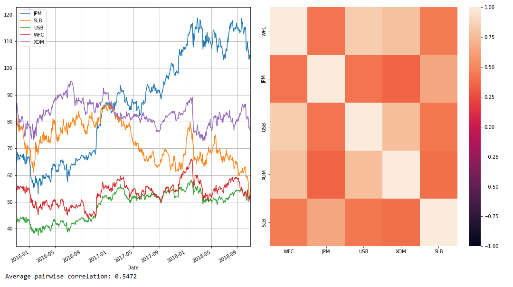
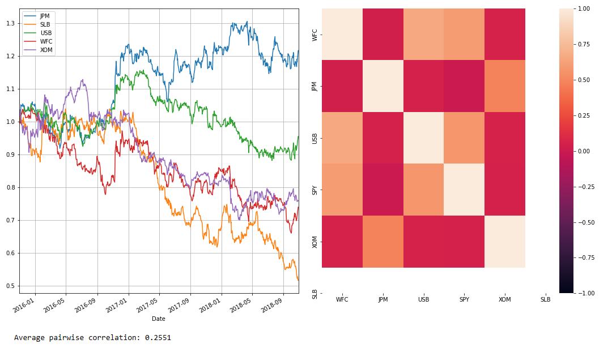
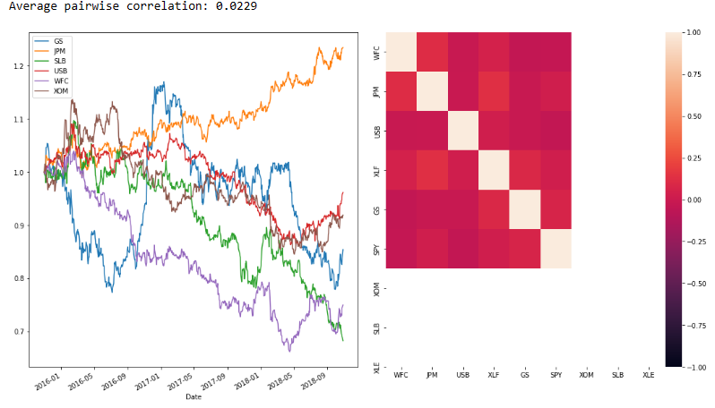

Whenever we have a trading strategy of any sort, we need to be considering the impact of systematic risk. There needs to be some risk involved in a strategy for a return above the risk-free rate, but systematic risk poisons the well, so to speak. By its nature, systematic risk provides commonality between the many securities in the market that cannot be diversified away. As such, we need to construct a hedge to eliminate it.

## Bet Correlation and Forecasts

We define a bet as the forecast of the residual of a security return. This forecast can be implicit -- i.e., we buy a stock, and thus we forecast that the stock price will rise. 

What are residuals? Without getting into the math, residuals are the difference between what is observed in the sample and what is predicted by the regression. Let's work through three examples. We use the Ledoit-Wolf covariance estimator to assess our covariance in all cases.

### The "No Hedge" Example

If we go long on a set of securities, without any short position, there is no hedge! So the residual is the stock return itself.

$$r_{resid,i}=r_{i}$$

```python
tickers = ['WFC', 'JPM', 'USB', 'XOM', 'SLB']

end = datetime.date(2018,10,30)
beg = end - relativedelta(years = 3)
historical_prices = pd.DataFrame(yf.download(tickers, start=beg, end=end))
rets = historical_prices['Close'].pct_change().fillna(0)
lw_cov = LedoitWolf().fit(rets).covariance_

def extract_corr_from_cov(cov_matrix):

    d = np.linalg.inv(np.diag(np.sqrt(np.diag(cov_matrix))))
    corr = d.dot(cov_matrix).dot(d)
    return corr

fig, (ax1, ax2) = plt.subplots(ncols=2, figsize=(15,9))
fig.tight_layout()


corr = extract_corr_from_cov(lw_cov)
# Plot prices
left = historical_prices['Close'].plot(ax=ax1)
left.grid()
left.set_xlim([beg, end])
# Plot covariance as a heat map
right = sns.heatmap(corr, ax=ax2, fmt='d', vmin=-1, vmax=1, xticklabels=tickers, yticklabels=tickers)
```


As we can see, the pairwise correlation is 54\%, which is a relatively moderate correlation. What does that mean? It basically means that our stocks will move in tandem majority of the time, so their will be almost no hedging. When USB goes up, chances are WFC and XOM will also go up as well. The fast majority of stocks are highly correlated with WFC, with the except of JPM.

## Beta Hedge

Now we will assume the bet is hedged against the overall market, namely the S&P 500. For this, we will use a technique known as **Beta Hedging**.

### What is Beta?

Factor models are a way of explaining the returns of one asset with a linear combination of the returns of the other assets. The general form of a factor model is

$$Y=\alpha + \beta_{1}X_{1} + \beta_{2}X_{2} + \ldots + \beta_{n}X_{n} $$

If it looks familiar, that's because the model is similiar to a linear regression. An asset's beta to another asset is just the $\beta$ from the above model. For instance, if we regressed TSLA against the S&P 500 using the model $Y_{TSLA}=\alpha+\beta X$, then TSLA beta exposure to the S&P 500 would be that beta. 

If we used the model $Y_{TSLA}=\alpha + \beta X_{SPY} + \beta X_{AAPL}$, then we now have two betas: the exposure of TSLA to the S&P and the exposure of AAPL to TSLA.

```python
tickers = ['WFC', 'JPM', 'USB', 'SPY', 'XOM', 'SLB' ]
historical_prices = pd.DataFrame(yf.download(tickers, start=beg, end=end))
rets = historical_prices['Close'].pct_change().fillna(0)

market = rets['SPY']
stock_rets = rets.drop('SPY', axis=1)
residuals = stock_rets.copy()*0

for stock in stock_rets.columns:
    model = sm.OLS(stock_rets[stock], market.values)
    results = model.fit()
    residuals[stock] = results.resid

lw_cov = LedoitWolf().fit(residuals).covariance_ # Calculate Ledoit-Wolf Estimator

fig, (ax1, ax2) = plt.subplots(ncols=2, figsize=(15,9))
fig.tight_layout()

corr = extract_corr_from_cov(lw_cov)
left = (1+residuals).cumprod().plot(ax=ax1)
left.set_xlim([beg, end])
left.grid()
right = sns.heatmap(corr, ax=ax2, fmt='d', vmin=-1, vmax=1, xticklabels=tickers, yticklabels=tickers)
```



As we can see, beta hedging brought down the average correlation significantly. The only downside with Beta Hedging is that you cannot diversify away from the systemic risk. However, you can mitigate this by hedging with sector exposure. There is no hedge if we go long on a set of securities but do not hold any short positions! So the residual is the stock return itself.

## Sector Hedge

The sector return and the market return are themselves highly correlated. As such, you cannot do a multivariate regression due to multicollinearity, a classic violation of regression assumptions. To hedge against both the market and a given security's sector, you first estimate the market beta residuals and then calculate the sector beta on those residuals.

$$r_{resid, i}=r_{i}-\beta_{i}r_{i}r_{resid_{SECTOR},i}=r_{resid,i}-\beta_{SECTOR,i}r_{resid,i}$$

Here, $r_{resid, i}$ is the residual between the security return and a market beta hedge and $r_{resid_{SECTOR, i}}$ the residual between that residual and a hedge of that residual against the relevant sector.

```python
tickers = ['WFC', 'JPM', 'USB', 'XLF', 'GS', 'SPY', 'XOM', 'SLB', 'XLE']
historical_prices = pd.DataFrame(yf.download(tickers, start=beg, end=end))
rets = historical_prices['Close'].pct_change().fillna(0)

# Get market hedge ticker
mkt = rets[['SPY']].columns
# Get sector hedge tickers
sector_1_hedge = rets[['XLF']].columns
sector_2_hedge = rets[['XLE']].columns
# Identify securities for each sector
sector_1_stocks = rets[['WFC', 'JPM', 'USB']].columns
sector_2_stocks = rets[['XOM', 'SLB', 'GS']].columns

market_rets = rets[mkt]
sector_1_rets = rets[sector_1_hedge]
sector_2_rets = rets[sector_2_hedge]

stock_rets = rets.drop(['XLF', 'SPY', 'XLE'], axis=1)
residuals_market = stock_rets.copy()*0
residuals = stock_rets.copy()*0

model = sm.OLS(sector_1_rets.values, market.values)
results = model.fit()
sector_1_excess = results.resid

model = sm.OLS(sector_2_rets.values, market.values)
results = model.fit()

sector_2_excess = results.resid

for stock in sector_1_stocks:
    # Calculate market betas for sector 1 stocks
    model = sm.OLS(stock_rets[stock], market.values)
    results = model.fit()
    # Calculate residual of security + market hedge
    residuals_market[stock] = results.resid
    # Calculate sector beta for previous residuals
    model = sm.OLS(residuals_market[stock], sector_1_excess)
    results = model.fit()
    # Get final residual
    residuals[stock] = results.resid

for stock in sector_2_stocks:
    # Calculate market betas for sector 2 stocks
    model = sm.OLS(stock_rets[stock], market.values)
    results = model.fit()
    # Calculate residual of security + market hedge
    residuals_market[stock] = results.resid
    # Calculate sector beta for previous residuals
    model = sm.OLS(residuals_market[stock], sector_2_excess)
    results = model.fit()
    # Get final residual
    residuals[stock] = results.resid

# Get covariance of residuals
lw_cov = LedoitWolf().fit(residuals).covariance_


fig, (ax1, ax2) = plt.subplots(ncols=2, figsize=(15,9))
fig.tight_layout()

corr = extract_corr_from_cov(lw_cov)
left = (1+residuals).cumprod().plot(ax=ax1)
right = sns.heatmap(corr, ax=ax2, fmt='d', vmin=-1, vmax=1, xticklabels=tickers, yticklabels=tickers)
```


And here we are. The Sector hedge has brought down the correlation between our bets close to zero.