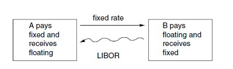

A swap is an agreement between two parties to exchange, or swap, future cashflows. The size of these cashflows is determined by some formulae, decided upon at the initiation of the contract. The swaps may be in a single currency or involve the exchange of cashflows in different currencies.

The swaps market is big. The total notional principal amount is, in US dollars, currently comfortably in 14 figures. This market really began in 1981 although there were a small number of swap-like structures arranged in the 1970s. Initially the most popular contracts were currency swaps, discussed below, but very quickly they were overtaken by the interest rate swap.

## The Vanilla Interest Rate Swap

In the interest rate swap the two parties exchange cashflows that are represented by the interest on a notional principal. Typically, one side agrees to pay the other a fixed interest rate and the cashflow in the opposite direction is a floating rate. The parties to a swap are shown schematically in the figure below. One of the commonest floating rates used in a swap agreement is LIBOR, London Interbank Offer Rate.

Commonly in a swap, the exchange of the fixed and floating interest payments occur every six months. In this case the relevant LIBOR rate would be the six-month rate. At the maturity of the contract the principal is not exchanged.

Here we construct the yield curve objects. For simplicity, we will use flat curves for discounting and Libor 3M. This will help us focus on the Swap construction part.

### Example

Suppose that we enter into a five-year swap on April 27th, 2016 (arbitary date), with semi-annual interest payments. We will pay to the other party a rate of interest fixed at 2.5% on a notional principal of $1 million; the counterparty will pay us three-month LIBOR. The straight lines denote a fixed rate of interest and thus a known amount; the curly lines are floating rate payments.

