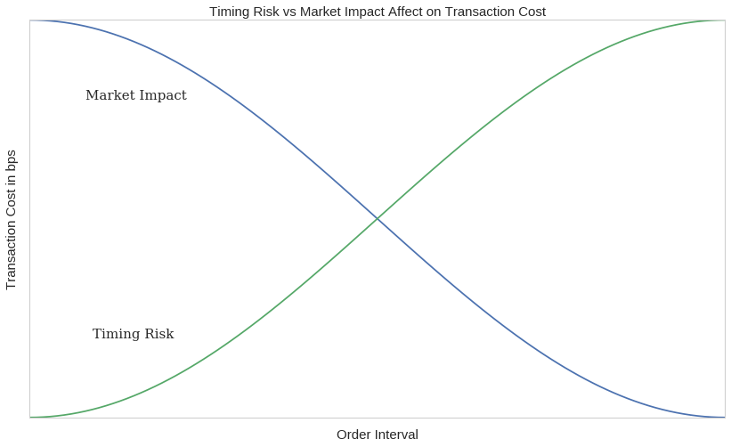
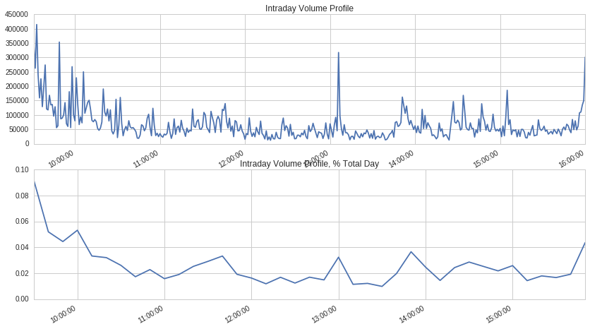
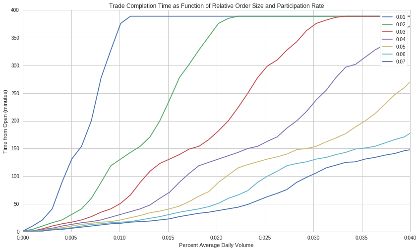
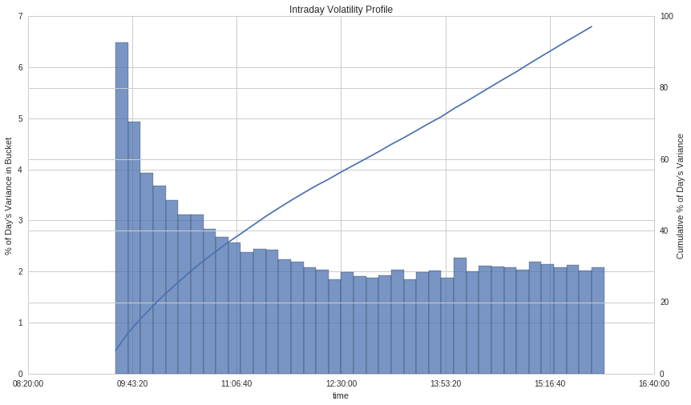
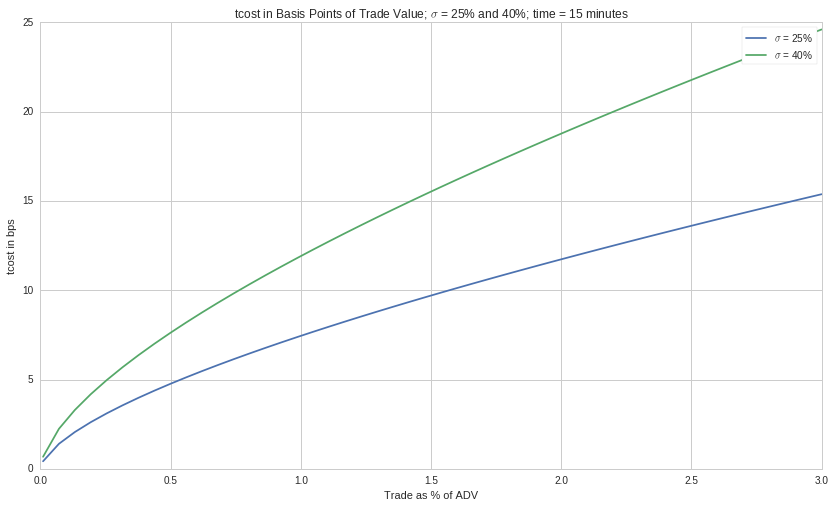
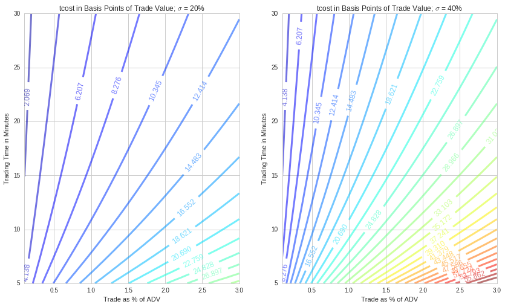
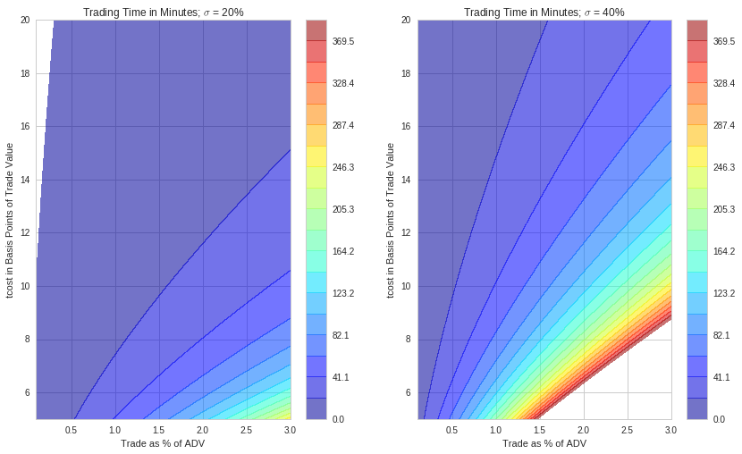
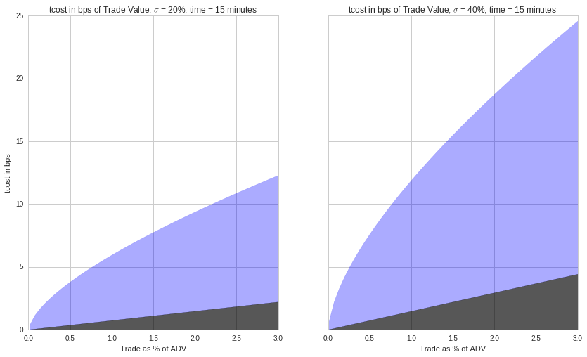
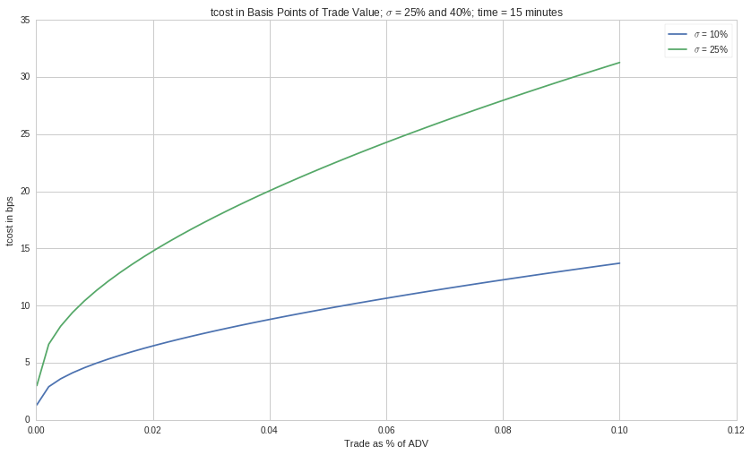

## Intro to Transaction Costs

There are generally two types of transaction cost

* Direct (commissions and fees)
* Indirect (market impact and spread costs)

Slippage is when the price 'slips' before the trade is fully executed, leading to the fill price being different from the price at the time of the order. The attributes of a trade that our research shows have the most influence on slippage are:

1. **Volatility**
2. **Liquidility**
3. **Relative order size**
4. **Bid - ask spread**

### Transaction Cost Impact on Portfolio Performance

Let’s consider a hypothetical mid-frequency statistical arbitrage portfolio. We will assume that our holding period is one week with 100 million dollars in AUM, with 2x leverage. At 2 times leverage, on 100 million in AUM, we trade 20 billion dollars per year.

Every single basis point (0.01%) of transaction cost translates into a 2% reduction of the algorithm's performance.

We can capture this effect with the following code:

```python
leverage = 2
turnover = 1
trading_days = 252
txn_cost_bps = 0.4

def perf_impact(leverage, turnover , trading_days, txn_cost_bps):
    p = leverage *  turnover * trading_days * txn_cost_bps/10000.
    return p

print perf_impact(leverage=2, turnover=0.4, trading_days=252, txn_cost_bps=1)

# 0.02016
```
### How do institutional quant trading teams evaluate transaction cost?

Quant teams typically utilize execution to complete orders fully while minimizing the cost of execution. To achieve this goal, main orders are often split into smaller orders and routed to different execution venues to capture all the available liquidity and minimize the bid-ask spread. The parent-level execution price can be expressed as the volume-weighted average price (VWAP) of all child orders.

We are going to use the following trading benchmarks:

* **Arrival Price** - the "decision" price of the algorithms, defined as the mid-quote at the time the algorithms placed the parent order (mid is the half-way point between the best bid and ask quotes)
* **Interval VWAP** - volume-weighted average price during the life of the order
* **T + 10 min** - price 10 min after the last fill vs execution price
* **T + 30 min** - price 30 min after the last fill vs execution price
* **Close** - price at close vs the execution price
* **Open** - price at open vs the execution price
* **Previous close** - price at previous close vs execution price (reversal)

Other metrics and definitions:

$$
Metric = \frac{Side * (Benchmark - Execution Price) * 100 * 100}{Benchmark}
$$

Key Ideas:

* **Execution Price** - volume-weighted average price of all fills or child orders
* **Cost vs Arrival Price** - difference between the arrival price and the execution price, expressed in basis points. 

The Cost vs. Arrival benchmark compares the execution price against the decision price of the strategy. This cost is sometimes called "slippage."

The temporary impact of the executed order is measured by the reversion metric. Typically, the stock price is expected to revert upon completion of the given order. However, the momentum metrics give us an indication of the direction of the price before execution. Trading with significant momentum often affects our ability to minimize the bid-ask spread costs.

When executing an order, one of the primary tradeoffs to consider is timing risk vs. market impact:

* **Timing Risk** - risk of price drift and information leakage as interval between arrival mid quote and last fill increases.
* **Market Impact** - (high urgency) risk of moving the market by shortening the interval between arrival mid quote and last fill.

Within this framework, neutral urgency of execution occurs at the intersection of market risk and market impact - in this case, each contributes the same to execution costs.

```python
x = np.linspace(0,1,101)
risk = np.cos(x*np.pi)
impact = np.cos(x* np.pi+ np.pi)

fig,ax = plt.subplots(1)
# Make your plot, set your axes labels
ax.plot(x,risk)
ax.plot(x,impact)
ax.set_ylabel('Transaction Cost in bps', fontsize=15)
ax.set_xlabel('Order Interval', fontsize=15)
ax.set_yticklabels([])
ax.set_xticklabels([])
ax.grid(False)
ax.text(0.09, -0.6, 'Timing Risk', fontsize=15, fontname="serif")
ax.text(0.08, 0.6, 'Market Impact', fontsize=15, fontname="serif")
plt.title('Timing Risk vs Market Impact Affect on Transaction Cost', fontsize=15)
plt.show()
```



### Liquidity

Liquidity can be viewed through several lenses. In execution management, it is activity measured in shares and USD traded and the frequency and size of trades executed in the market. "Good" liquidity is also achieved through diverse market participants on both sides of the market.

Assess Liquidity by:

* intraday volume curve
* percent of day's volume
* percent of average daily dollar volume in an interval
* cummulative intraday volume curve
* relative order size

In general, liquidity is highest as we approach the close, second highest at the open, and mid-day has the lowest liquidity. Liquidity should also be viewed relative to your order size and other securities in the same sector and class.

```python
tickers = symbols(['FB']) # Facebook ticker
num_stocks = len(tickers)

# %%timeit -n1 -r1 magic is not allowed in Q
start = time.time()
data = get_pricing(tickers,
                   fields='volume',
                   frequency='minute',
                   start_date='2016-1-1',
                   end_date='2016-7-1')
end = time.time()
print "Time: %0.2f seconds." % (end - start)
data = data.tz_convert('US/Eastern') # Q data comes in as UTC

dat = data[symbols('FB')]
plt.subplot(211)
dat['2016-04-14'].plot(title='Intraday Volume Profile') # intraday volume profile plot 
plt.subplot(212)
(dat['2016-04-14'].resample('10t', closed='right').sum()/\
     dat['2016-04-14'].sum()).plot(); # percent volume plot
plt.title('Intraday Volume Profile, % Total Day');
```


### Relative Order Size

The time to complete the order increases as we increase the relative order size at a specified participation rate. Let's assume we execute an order using VWAP. This scheduling strategy runs orders over a pre-specified time window, according to the projections of volume distribution throughout that time window: At a 3% participation rate for VWAP execution, we require the entire day to trade if our order represents 3% of the average daily volume.

Suppose we expect our algorithm to have high relative order sizes. In that case, we can switch to a liquidity management execution strategy when trading to ensure order completion by the end of the day. Liquidity management execution strategies have specific constraints for the urgency of execution, choice of execution venues, and spread capture with the objective of order completion. Returning to our risk curves, we expect higher transaction costs the longer we trade. Therefore, the higher the percent ADV of the order, the more expensive to trade.

```python
dat = get_pricing(symbols(['FB']), fields='volume', frequency='minute', start_date='2016-1-1', end_date='2018-1-2')
dat = dat.tz_convert('US/Eastern') # Q data comes in as UTC


def relative_order_size(participation_rate, pct_ADV):
    fill_start = dat['2017-10-02'].index[0] # start order at 9:31
    ADV20 = int(dat.resample("1d").sum()[-20:].mean()) # calculate 20 day ADV
    order_size = int(pct_ADV * ADV20)
    #print 'order size:', order_size, 'daily volume:', dat['2016-07-01'].sum()/(1.0*10**6), 'M shares'
    try :
        ftime = dat['2017-10-02'][(order_size * 1.0 / participation_rate)<=dat['2017-10-02'].cumsum().values].index[0]
    except: 
        ftime = dat['2017-10-02'].index[-1] # set fill time to 4p 
    fill_time = max(1,int((ftime - fill_start).total_seconds()/60.0))
    #print 'order fill time' ,fill_time,  'minutes'
    return fill_time

def create_plots(participation_rate, ax):
    df_pr = pd.DataFrame(data=np.linspace(0.0,0.1,100), columns = ['adv'] ) # create dataframe with intervals of ADV
    df_pr['pr'] = participation_rate # add participation rate column

    df_pr['fill_time'] = df_pr.apply(lambda row: relative_order_size(row['pr'],row['adv']), axis = 1) # get fill time

    ax.plot(df_pr['adv'],df_pr['fill_time'], label=participation_rate) # generate plot line with ADV and fill time

fig, ax = plt.subplots() 
for i in [0.01,0.02,0.03,0.04,0.05,0.06,0.07]: # for participation rate values
    create_plots(i,ax) # generate plot line
    
plt.ylabel('Time from Open (minutes)')
plt.xlabel('Percent Average Daily Volume')
plt.title('Trade Completion Time as Function of Relative Order Size and Participation Rate')
plt.xlim(0.,0.04)
ax.legend()
```


### Volatility

Volatility is a statistical measure of the dispersion of returns for an asset. Calculated as the standard deviation of returns. The volatility of any given stock typically peaks at the open and decreases until mid-day. The higher the volatility, the more uncertainty in the returns. This uncertainty is an artifact of larger bid-ask spreads during the price discovery process at the start of the trading day. In contrast to liquidity, where we would prefer to trade at the open to take advantage of high volumes, to take advantage of low volatility, we would trade at the close.

We use two methods to calculate volatility for demonstration purposes, OHLC and, the most common, close-to-close. OHLC uses the Garman-Klass Yang-Zhang volatilty estimate that employs open, high, low, and close data.

The OHLC Volatility Estimation Method is as follows:

$$
\sigma^{2}=\frac{Z}{n}\sum\bigg[\bigg(ln\frac{O_{i}}{C_{i-1}}\bigg)^{2}+\frac{1}{2}\bigg(ln\frac{H_{i}}{L_{i}}\bigg)^{2}-(2ln2-1)\bigg(ln\frac{C_{i}}{O_{i}}\bigg)^{2}\bigg]
$$

There is also the Close-to-Close Historical Volatility Estimation Method. Volatility is calculated as the annualised standard deviation of log returns:

$$
Log Return = x_{1}=ln(\frac{c_{i}+d_{i}}{c_{i}-1})
$$

where $d_{i}$ are the ordinary (not adjusted) dividends and $c_{i}$ is the close price

$$Volatility = \sigma_{x}\sqrt{\frac{1}{N}\sum^{N}_{i=1} (x-\bar{x})^{2} }$$



### Quantifying Market Impact

Theoritical Market Impact models attempt to estimate transaction costs of trading by utilizing order attributes. There are many published market impact models. Here are some examples:

1. Almgren et al 2005
2. Kissell et al. 2004
3. J.P. Morgan Model 2010

The models have a few commonalities, such as the inclusion of relative order size, volatility, and custom parameters calculated from observed trades. There are also notable differences in the models, such as (1) JPM explicitly calls out spread impact, (2) Almgren considers a fraction of outstanding shares traded daily, (3) the Q Slipplage Model does not consider volatility, and (4) Kissel explicit parameter to proportion temporary and permanent impact, to name a few.

The academic models have notions of temporary and permanent impact. **Temporary Impact** captures the impact on transaction costs due to the urgency or aggressiveness of the trade. While **Permanent Impact** estimates concerning the information or short-term alpha in a trade.

### Almgren et al. model (2005)

This model assumes the initial order, $X$, is completed at a uniform rate of trading over a volume time interval T. That is, the trade rate in volume units is $v = X/T$, and is held constant until the trade is completed. Constant rate in these units is equivalent to $VWAP$ execution during the time of execution.

Almgren et al. model these two terms as

$$tcost = 0.5\overbrace{\gamma\sigma\frac{X}{V}\bigg(\frac{\Theta}{V}\bigg)^{1/4}}^{\text{permanent}}+\overbrace{\eta\sigma\Bigg|\frac{X}{VT} \Bigg|^{3/5}}^{\text{temporary}}$$

where $\gamma$ and $\eta$ are the "universal coefficients of market impact" and estimated by the authors using a large sample of institutional trades; $\sigma$ is the daily volatility of the stock; $\Theta$ is the total shares outstanding of the stock; $X$ is the number of shares you would like to trade (unsigned); $T$ is the time width in % of trading time over which you slice the trade; and $V$  is the average daily volume in shares of the stock.

The interpretation of $\frac{\Theta}{V}$ is the inverse of daily "turnover", the fraction of the company's value traded each day. For reference, FB has 2.3B shares outstanding, its average daily volume over 20 days is 18.8M therefore its inverse turnover is approximately 122, put another way, it trades less than 4% of outstanding shares daily.

#### Potential Limitations

Note that the Almgren et al (2005) and Kissell, Glantz and Malamut (2004) papers were released prior to the adoption and phased implementation of Reg NMS, prior to the "quant meltdown" of August 2007, prior to the financial crisis hitting markets in Q4 2008, and other numerous developments in market microstructure [[4](#4)].

```python
def perm_impact(pct_adv, annual_vol_pct = 0.25, inv_turnover = 200):
    gamma = 0.314
    return 10000 * gamma * (annual_vol_pct / 16) * pct_adv * (inv_turnover)**0.25

def temp_impact(pct_adv, minutes, annual_vol_pct = 0.25, minutes_in_day = 60*6.5):
    eta = 0.142
    day_frac = minutes / minutes_in_day
    return 10000 * eta * (annual_vol_pct / 16) * abs(pct_adv/day_frac)**0.6

def tc_bps(pct_adv, minutes, annual_vol_pct = 0.25, inv_turnover = 200, minutes_in_day = 60*6.5):
    perm = perm_impact(pct_adv, annual_vol_pct=annual_vol_pct, inv_turnover=inv_turnover)
    temp = temp_impact(pct_adv, minutes, annual_vol_pct=annual_vol_pct, minutes_in_day=minutes_in_day)
    return 0.5 * perm + temp
```

So if we are trading 10% of ADV of a stock with a daily vol of 1.57% and we plan to do this over half the day, we would expect 8bps of TC (which is the Almgren estimate of temporary impact cost in this scenario). From the paper, this is a sliver of the output at various trading speeds:




And let's look a tcost as a function of trading time and % ADV.



Alternatively, we might want to get some intuition as to if we wanted to limit our cost, how does the trading time vary versus % of ADV.



#### The Breakdown: Permanent and Temporary

For a typical stock, let's see how the tcost is broken down into permanent and temporary.

```python
minutes = 30

x = np.linspace(0.0001,0.03)

f, (ax1, ax2) = plt.subplots(ncols=2, sharex=True, sharey=True)
f.subplots_adjust(hspace=0.15)
    
p = 0.5*perm_impact(x,0.20)
t = tc_bps(x,minutes,0.20)
ax1.fill_between(x*100, p, t, color='b', alpha=0.33);
ax1.fill_between(x*100, 0, p, color='k', alpha=0.66);
ax1.set_ylabel('tcost in bps')
ax1.set_xlabel('Trade as % of ADV')
ax1.set_title('tcost in bps of Trade Value; $\sigma$ = 20%; time = 15 minutes');

p = 0.5*perm_impact(x, 0.40)
t = tc_bps(x,minutes, 0.40)
ax2.fill_between(x*100, p, t, color='b', alpha=0.33);
ax2.fill_between(x*100, 0, p, color='k', alpha=0.66);

plt.xlabel('Trade as % of ADV')
plt.title('tcost in bps of Trade Value; $\sigma$ = 40%; time = 15 minutes');
```



### Kissell et al Model (2004)

Kissell et al. model assume a theoretical instantaneous impact cost incurred by the investor if all shares were released to the market.

$$
MI_{bp}=b_{1}IPOV^{a4}+(1-b_{1})I
$$
$$I=a_{1}(\frac{Q}{ADV})^{a2}\sigma^{a3}$$
$$POV=\frac{Q}{Q+V}$$

Where:

* $I$ is the instantaneous impact
* $POV$ is the percentage of the volume trade
* $V$ is the expected volumn of the trading interval
* $b_{1}$ is the temporary impact parameter
* $ADV$ is the trading volume of the last 30 days
* $Q$ is the order size

```python
def kissell(adv, annual_vol, interval_vol, order_size):
    b1, a1, a2, a3, a4 = 0.9, 750., 0.2, 0.9, 0.5
    i_star = a1 * ((order_size/adv)**a2) * annual_vol**a3
    PoV = order_size/(order_size + adv)
    return b1 * i_star * PoV**a4 + (1 - b1) * i_star

print(kissell(adv = 5*10**6, annual_vol = 0.2, interval_vol = adv * 0.06, order_size = 0.01 * adv ), 'bps')

x = np.linspace(0.0001,0.1)
plt.plot(x,kissell(5*10**6,0.1, 2000*10**3, x*2000*10**3), label="$\sigma$ = 10%");
plt.plot(x,kissell(5*10**6,0.25, 2000*10**3, x*2000*10**3), label="$\sigma$ = 25%");
#plt.plot(x,kissell(5*10**6,0.40, 2000*10**3, x*2000*10**3), label="$\sigma$ = 40%");
plt.ylabel('tcost in bps')
plt.xlabel('Trade as % of ADV')
plt.title('tcost in Basis Points of Trade Value; $\sigma$ = 25% and 40%; time = 15 minutes');
plt.legend();
```



## References


[<a name="1">1</a>] [Almgren, R., Thum, C., Hauptmann, E., & Li (2005) | Direct estimation of equity market impact. Risk, 18(7), 5862](https://www.google.com/search?q=Direct+estimation+of+equity+market+impact.&rlz=1C1UEAD_enUS962US962&oq=Direct+estimation+of+equity+market+impact.&aqs=chrome..69i57j0i22i30j0i390i650l2.676j0j7&sourceid=chrome&ie=UTF-8)

[<a name="2">2</a>] [Bennett, C. and Gil, M.A. (2012) | Measuring Historic Volatility, Santander Equity Derivatives Europe](http://www.todaysgroep.nl/media/236846/measuring_historic_volatility.pdf)

[<a name="3">2</a>] [Garman, M. B., & Klass, M. J. (1980) | On the estimation of security price volatilities from historical data. Journal of business, 67-78](https://www.jstor.org/stable/2352358)

[<a name="4">4</a>] [Securities And Exchange Commission | 17 CFR Parts 200, 240, 242, 249, and 270 ](https://www.sec.gov/rules/final/34-51808.pdf)