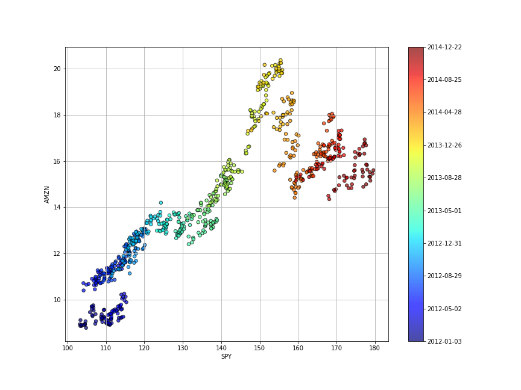
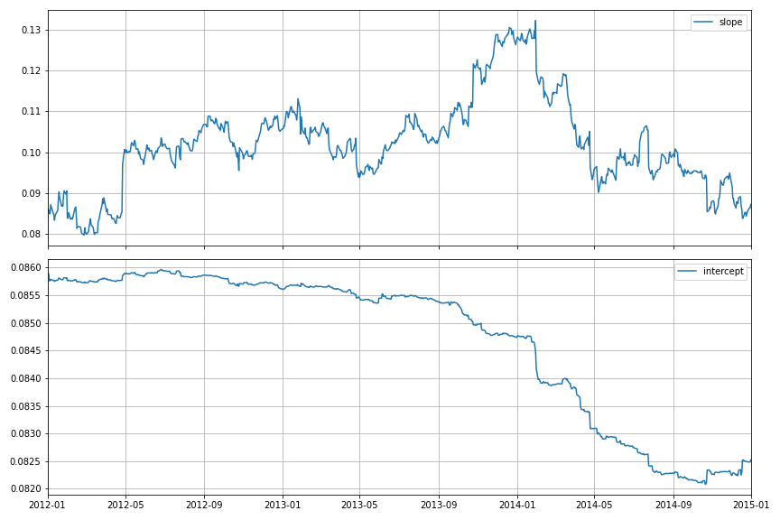
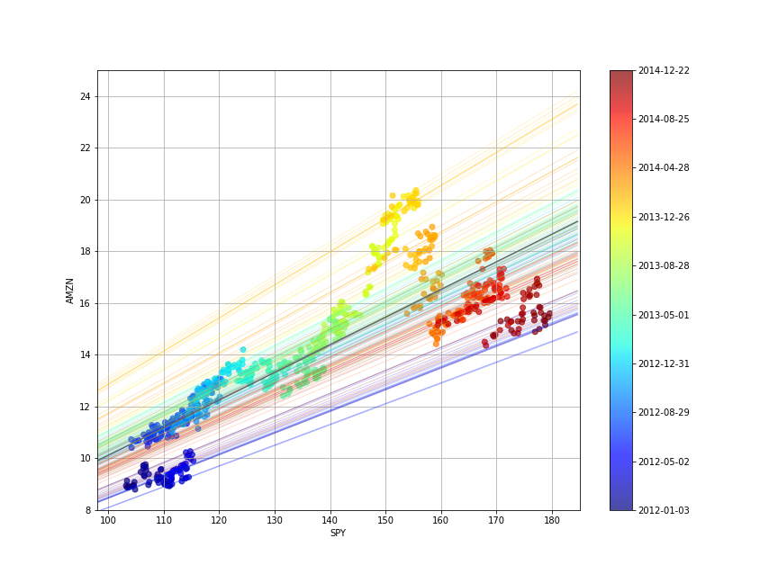
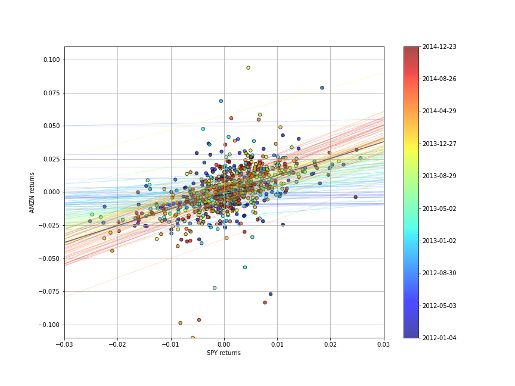

In these post, I will be focusing on applying various time series analysis methods for stock market data utilizing Kalman Filters.

## What are Kalman Filters?

A Kalman Filter is a state-space model applied to linear dynamic systems; systems whose state is time-dependent and state variations are represented linearly. The model is used to estimate unknown states of a variable based on a series of past values. The procedure is two-fold: a prediction (estimate) is made by the filter of the current state of a variable and the uncertainty of the estimate itself. When new data is available, these estimates are updated.

In Quant Finance, particularly trading, Kalman Filter is used to update hedging ratios between assets in a statistical arbitrage pairs trade. Generally, there are three types of inference that are of interest when considering state space models:

* Prediction: Forecasting subsequent values of the state
* Filtering: Estimating the current values of the state from past and current observations
* Smoothing: Estimating the past values of the state given the observations

### Linear Regression using the Kalman Filter

How do we utilise this state space model approach to incorporate the information in a linear regression? We start with a simple equation:

$$
y_{t}\approx\alpha+\beta x_{t} 
$$

where $\beta$ represents the transpose vector of the intercept $\beta_{0}$ and slope $\beta_{i}$, with $\alpha \sim \mathcal{N}(\mu, \sigma^{2})$ represents the error term. Generally represented as $\epsilon$ for mathematical purposes, but for finance, we will use the formula as it is described in the Modern Portfolio Theory.

This is because we assume that tomorrow’s intercept and slope are equal to today’s intercept and slope with the addition of some random system noise. This gives it the nature of a random walk, a prominent concept for MPT.

We set the states of our system to be given by the vector $\beta$: the intercept and slope of our linear regression.

```python
import yfinance as yf
import pandas as pd
import datetime
from dateutil.relativedelta import relativedelta
import matplotlib.pyplot as plt
from scipy import poly1d
import numpy as np
from pykalman import KalmanFilter


end = datetime.date(2018,10,30)
beg = end - relativedelta(years = 3)
x = pd.DataFrame(yf.download('AMZN', start=beg, end=end)['Adj Close'])
y = pd.DataFrame(yf.download('SPY', start=beg, end=end)['Adj Close'])
# df_post_gr = df[(df.index>= '2015-10-30')]

c = np.arange(len(df_post_gr.index))

fig = plt.figure(figsize=(12, 9))
ax = fig.add_subplot(1,1,1)

cm = plt.get_cmap('jet')
plt.scatter(x, y, cmap=cm, c=c,alpha=0.7)

cbar = plt.colorbar(ax = ax)
cbar.set_ticks([int(i) for i in cbar.get_ticks()])
cbar.set_ticklabels([x.index[int(i)].strftime('%b %Y') for i in cbar.get_ticks()[:9]])

# ax.set_title(df_post_gr.index[0].strftime('%b %Y')+' to '+df_post_gr.index[-1].strftime('%B %Y'))

ax.set_xlabel('SPY')
ax.set_ylabel('AMZN')
ax.grid()
```


The state of our system is the line that the observations are the following, with the parameters $\alpha$ and $\beta$. The initial assumptions for these parameters (0,0), with a covariance matrix of all ones. The general assumption is that our parameters follow a random walk with a small error term.

To derive the state in our system to an observation, we mark the state $(\beta, \alpha)$ with $(x_{i},1)$ to arrive at $\beta x_{i} + \alpha \approx y_{i}$,so our observation matrix is just a column of 1s' with to $x$ attached.

We assume that the variance of our observation, $y$, is 2. Now we are ready to use our observations of $y$ to derive our estimates of the parameters $\alpha$ and $\beta$.

```python
delta = 1e-3
trans_cov = delta / (1 - delta) * np.eye(2) # How much random walk wiggles
obs_mat = np.expand_dims(np.vstack([[df['SPY'].values], [np.ones(len(df['SPY'].values))]]).T, axis=1)


kf = KalmanFilter(n_dim_obs=1, n_dim_state=2, # y is 1-dimensional, (alpha, beta) is 2-dimensional
                  initial_state_mean=[0,0],
                  initial_state_covariance=np.ones((2, 2)),
                  transition_matrices=np.eye(2),
                  observation_matrices=obs_mat,
                  observation_covariance=2,
                  transition_covariance=trans_cov)

# Use the observations y to get running estimates and errors for the state parameters
state_means, state_covs = kf.filter(df['AMZN'].values)

_, axarr = plt.subplots(2, sharex=True, figsize=(12,8))

axarr[0].plot(df['SPY'].index, state_means[:,0], label='slope')
axarr[0].legend()
axarr[0].set_xlim([datetime.date(2016, 10, 30), datetime.date(2018, 10, 29)])
axarr[0].grid()
axarr[1].plot(df['SPY'].index, state_means[:,1], label='intercept')
axarr[1].set_xlim([datetime.date(2016, 10, 30), datetime.date(2018, 10, 29)])
axarr[1].legend()
axarr[1].grid()
plt.tight_layout();
```



Notice how the parameters fluctuate over a long period of time.  If we were to create a trading algorithm based on this data (something like beta hedging), it's important to have the most current estimate of the beta.

We can visualize how the system evolves through time by plotting every fifth state (linear model). We can also use a black line for the ordinary least-square regression on the full dataset.

```python
c = np.arange(len(x.index))


fig = plt.figure(figsize=(12, 9))
ax = fig.add_subplot(1,1,1)

cm = plt.get_cmap('jet')
plt.scatter(x, y, cmap=cm, c=c,alpha=0.7)

# Plot every fifth line
step = 5
xi = np.linspace(x.min()-5, x.max()+5, 2)
colors_l = np.linspace(0.1, 1, len(state_means[::step]))
for i, beta in enumerate(state_means[::step]):
    plt.plot(xi, beta[0] * xi + beta[1], alpha=.2, lw=1, c=cm(colors_l[i]))
    
# Plot the OLS regression line
cb = plt.colorbar(sc)
cb.ax.set_yticklabels([str(p.date()) for p in x[::len(x)//9].index])

plt.plot(xi, poly1d(np.polyfit(x, y, 1))(xi), '0.4')

plt.axis([98, 185, 8, 25])

# Label axes
plt.xlabel('SPY')
plt.ylabel('AMZN');
plt.grid()
```


Although all of the state estimates take into account all previous observations, they fit the more recent data better than the older data. This allows the filter to adapt to structural changes in the data over time.

Most of the time the correlation will be more important, as returns are more correlation than prices, so let's quickly use the same linear regression structure on the returns data:

```python
x_r = x.pct_change()[1:]
y_r = y.pct_change()[1:]

# Run Kalman filter on returns data
delta_r = 1e-2
trans_cov_r = delta_r / (1 - delta_r) * np.eye(2) # How much random walk wiggles
obs_mat_r = np.expand_dims(np.vstack([[x_r], [np.ones(len(x_r))]]).T, axis=1)
kf_r = KalmanFilter(n_dim_obs=1, n_dim_state=2, # y_r is 1-dimensional, (alpha, beta) is 2-dimensional
                  initial_state_mean=[0,0],
                  initial_state_covariance=np.ones((2, 2)),
                  transition_matrices=np.eye(2),
                  observation_matrices=obs_mat_r,
                  observation_covariance=.01,
                  transition_covariance=trans_cov_r)
state_means_r, _ = kf_r.filter(y_r.values)

# Plot data points using colormap

fig = plt.figure(figsize=(12, 9))
colors_r = np.linspace(0.1, 1, len(x_r))
sc = plt.scatter(x_r, y_r, s=30, c=colors_r, cmap=cm, edgecolor='k', alpha=0.7)
cb = plt.colorbar(sc)
cb.ax.set_yticklabels([str(p.date()) for p in x_r[::len(x_r)//9].index])

# Plot every fifth line
step = 5
xi = np.linspace(x_r.min()-4, x_r.max()+4, 2)
colors_l = np.linspace(0.1, 1, len(state_means_r[::step]))
for i, beta in enumerate(state_means_r[::step]):
    plt.plot(xi, beta[0] * xi + beta[1], alpha=.2, lw=1, c=cm(colors_l[i]))

# Plot the OLS regression line
plt.plot(xi, poly1d(np.polyfit(x_r, y_r, 1))(xi), '0.4')

# Adjust axes for visibility
plt.axis([-0.03,0.03,-0.11, 0.11])

# Label axes
plt.xlabel('SPY returns')
plt.ylabel('AMZN returns');

```



Although the raw data is much more jumbled here, we can see the regression line evolving, even swinging past the OLS regression line.