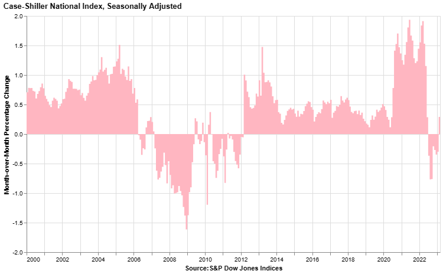
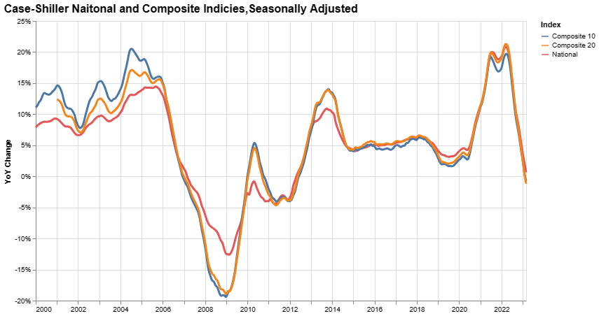
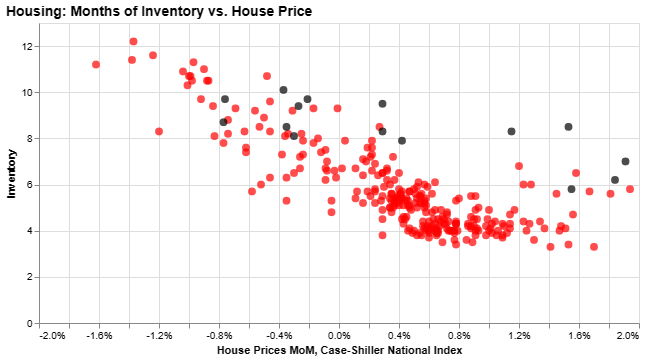

S&P and Case-Shiller released the monthly Home Price Indices for March. January closing prices include some contracts signed in November, so this data has a significant lag.

The Month-over-Month (MoM) increase in the SA Case-Shiller Index was 0.42%. This was the second increase following seven consecutive declines [[1](#1)].

On a seasonally adjusted basis, prices declined monthly in 5 of 20 Case-Shiller cities. The most significant monthly declines seasonally adjusted were in Seattle (-0.9%), Phoenix (-0.4%), and Las Vegas (-0.4%). Seasonally adjusted, Seattle has fallen 12.5% from the peak in May 2022, and San Francisco is down 11.3% from the peak. 19 of 20 cities have seen price declines from the recent peak (SA). Chicago is the exception.

From S&P:
> Before seasonal adjustment, the U.S. National Index posted a 1.3% month-over-month increase in March, while the 10-City and 20-City Composites posted increases of 1.6% and 1.5%, respectively.
>
> After seasonal adjustment, the U.S. National Index posted a month-over-month increase of 0.4%, while the 10-City Composite gained 0.6% and 20-City Composites posted an increase of 0.5%.

The Composite 10 index is up 0.6% in March (SA) and down 3.7% from the recent peak in June 2022. The Composite 20 index is up 0.5% (SA) in March and down 4.2% from the recent peak in June 2022. The National index is up 0.4% (SA) in March and is down 2.3% from the peak in June 2022.

The Composite 10 SA is down 0.8% year-over-year.  The Composite 20 SA is down 1.1% year-over-year. The National index SA is up 0.7% year-over-year.

We can also compare existing home months-of-supply from the National Association of Realtors (NAR) vs. the seasonally adjusted month-to-month price change in the Case-Shiller National Index (From January 1999 through March 2023).

The last eleven months are in black showing a shift in the relationship, and prices fell for seven months with low levels of inventory.

In March, the months-of-supply was at 2.6 months, and the Case-Shiller National Index (SA) increased 0.42% month-over-month.  Historically prices haven’t declined until inventory reached 6 months of supply. In the April existing home sales report, the NAR reported months-of-supply increased to 2.9 months. The year-over-year Case-Shiller house price increase was below expectations.

The March report was mostly for contracts signed in the November through February period and was likely boosted by somewhat lower rates in the December through February period.

## Sources

[<a name="1">1</a>] [S&P Global | S&P Corelogic Case-Shiller Index Rebound Countinued in March](https://www.spglobal.com/spdji/en/index-announcements/article/sp-corelogic-case-shiller-index-rebound-continued-in-march/)
