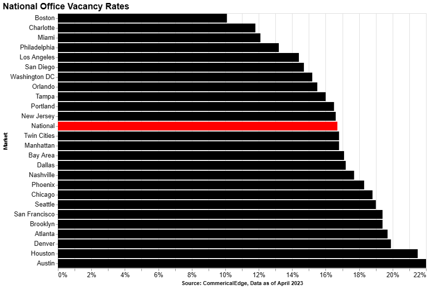

Nearly 20% of office spaces are currently empty across the United States. This is higher than the vacancy rate during the 2008 global financial crisis, and it's worse in places like San Francisco and downtown Los Angeles, where more than a quarter of offices are empty [[1](#1)].

Rising interest rates, falling prices, and the trend of hybrid working in the wake of the pandemic reduced demand for office space, straining the commercial property market. And these troubles have only gotten worse as the recent bank failures raised fears about other regional banks that account for the bulk of commercial real estate loans running into trouble.

Economic concerns and the regional banking crisis have led US banks to tighten their lending standards for all categories of commercial real estate loans, according to the latest senior loan officer survey published by the Federal Reserve. Most US banks said they tightened credit standards for loans secured by non-residential properties in the first quarter, while none said they eased standards [[2](#2)]. Some lenders even require personal guarantees from property owners — in which borrowers pledge their personal assets to secure a mortgage. The extent to which these more restrictive lending practices prevent existing borrowers from refinancing commercial real estate loans remains to be seen. 

If companies continue to give up their leases and demand for office space remains as slow as it has been, office landlords will struggle to collect enough rent to keep up with mortgage payments to pay off commercial loans. Many of these loans are coming due in the next year, and many building owners need to refinance their debts when low occupancy has eroded building values, interest rates have gone up, and banks have become significantly more reluctant to lend.

This is not just an issue in the United States; while workers in Europe and the UK have been quicker to return to the office than in the US, vacant office space in the UK is still at its highest level in nine years [[3](#3)]. The amount of empty office space has climbed steadily since the start of the pandemic in March 2020. 

Swedish office landlord Castellum had to issue additional shares and has divested some of its properties to reduce its loan-to-value ratio from 44 percent to 38 percent. SBB, one of Sweden’s biggest landlords, abandoned an equity capital raise, canceled its dividend, and is now selling off assets to reduce its loan-to-value ratio from 47 percent [[4](#4)] [[5](#5)]. On the other hand, German residential landlords are expected to make their own cash calls soon. 

Earlier this month in the UK, St James’s Place’s property fund sold 141 Wardour Street - an aging art deco block in London’s Soho for 39 million pounds, 30 percent below what they paid to repurchase the property in 2018. British Land - one of the UK’s largest landlords announced on Wednesday that property values had fallen 12.3 percent in the first quarter of 2023 [[6](#6)]. Valuations for offices and factories have fallen almost as much over the last year as in the 20-month price decline that began in September 2007.

So overall, things are not great for landlords. 

While things are not going well for commercial real estate investors, increased defaults and foreclosures could cause problems for banks that make commercial real estate loans too. The majority of the 1.2 trillion dollars in US office space debt is owed to regional banks, who have been more aggressive in this style of lending than large (too big to fail) banks have been due to the lower regulation they have faced since the credit crunch. If office landlords can't make their debt payments, these banks would end up owning the commercial properties and need to sell them, which would be difficult in such an environment.

The problems in commercial real estate have drawn the attention of the Federal Reserve, which published a report last week saying that they have increased monitoring of the performance of Commercial Real Estate loans and expanded examination procedures for banks with significant Commercial Real Estate concentration risk [[7](#7)]. When trying to understand the extent of the problem, it’s become more and more difficult to calculate the actual value of office buildings in the current market environment. Investors are looking at things like office badge swipes and cell phone usage in business districts to get a better understanding of how much office buildings are being used and what the demand for space will be going forward.

Academics Arjun Ramani and Nicholas Bloom wrote a paper last year called the donut effect that used data from the US Postal Service and Zillow to understand the migration patterns and changes happening in real estate markets in American cities. They found that in large US cities, real estate demand shifted from central business districts to lower-density suburbs and exurbs which gave them their paper title “The Donut Effect,” which reflects the hollowing out of city centers and the growth of suburban outer rings, which appears to be happening. They found sizeable donuts in large cities, smaller donuts in mid-sized towns, and no fundamental changes in small cities, on average [[8](#8)].

The rising office vacancies in big American cities are already changing the ecosystems of downtown city centers. Stores, restaurants, dry cleaners, and convenience stores that depend on heavy five-day-a-week foot traffic are struggling to survive. For public transportation systems in doughnut effect cities, fewer commuters are leading to budget deficits and massive projected shortfalls. For local governments, high office vacancies will mean a drop in property tax revenues, burning a hole in city finances. So, it’s not just real estate investors taking a hit.

So, should we expect to see financial contagion - where the problems in commercial real estate lead to problems at banks, which then lead to another credit crunch? Well, not according to Barclays. The economics team at Barclays argued in a note last month that the worst fears of economic contagion from a collapse in office-property valuations might be overdone. They point out that Office real estate (where the problems are most concentrated) makes up around 25% of the US commercial real estate market – so the problem (for banks) is maybe not as big as many people think.

They additionally highlight that office loans — and office leases — are long-term contracts. So, a long chain of events has to occur before the popularity of working from home causes widespread defaults on office loans that then hit banks. The team at Barclays points out that “office availability,” a statistic that measures how much space is vacantly combined with how much space will open up in coming months, hasn’t climbed too dramatically. This is partially because there was a slowdown in the construction of new office buildings once the pandemic began. Looking at this statistic, things don’t look as bad as they look when considering vacancies. 

The Barclays note points out that office landlords run into problems when a large percentage of their leases roll over -- and the tenants don’t renew -- or when an office loan is maturing and is either not being extended by the lender or is being extended at a much higher interest rate. The worst situation is when both happen at once. A drop in property prices (while bad for landlords and quite worrying for lenders) isn’t enough to spark a loan default. Commercial Real Estate borrowers usually hold on to a property that continues to bring in enough rent to cover the loan payments, even if the property value has declined significantly. This makes sense as there is upside optionality. Even if all equity has eroded, as long as the cash flow is positive or breaks even, the landlord will hand it on with the hope that there is a recovery.

Finally, and most importantly, Barclays points out that if we are going to worry about a re-run of the Global Financial Crisis, we have to keep in mind that since the financial crisis, banks have much more capital, leverage is much lower, and policymakers are acutely aware of not allowing counterparty risk to go unchecked. They say that the potential losses just aren’t significant enough to make a dent in aggregate bank capital. 

Bank of America’s monthly fund manager survey shows that fund managers have already cut their allocations to commercial real estate, and their allocations to the sector are at the lowest levels since the 2008 financial crisis. Almost half of the fund managers in the survey said that they viewed commercial real estate as the most likely cause of a systemic event, compared with just 8 percent who viewed a downgrade of US debt due to the dispute in Washington over the debt ceiling as the main risk [[9](#9)].

Interestingly, the same survey in April last year showed that fund managers had reached their highest allocations to commercial real estate in 16 years, showing how quickly sentiment towards the sector changed when interest rates started increasing.

## Sources

[<a name="1">1</a>] [Cushman & Wakefield | Q1 2023 U.S. Office MarketBeat](https://www.cushmanwakefield.com/en/united-states/insights/us-marketbeats/us-office-marketbeat-reports)

[<a name="2">2</a>] [Board of Governors of the Federal Reserve | Senior Loan Officer Opinion Survey on Bank Lending Practices](https://www.federalreserve.gov/data/sloos/sloos-202304-table-1.htm)

[<a name="3">3</a>] [Statista | Office real estate vacancy rate in Central London from 2013 to 2022](https://www.statista.com/statistics/529662/office-real-estate-vacany-rate-central-london-england-united-kingdom/)

[<a name="4">4</a>] [MarketScreener| Castellum divests properties for a total of SEK 2.3 Bn](https://www.marketscreener.com/quote/stock/CASTELLUM-AB-PUBL-6491340/news/Castellum-divests-properties-for-a-total-of-SEK-2-3-Bn-43851149/#:~:text=Castellum%20is%20divesting%20two%20properties,line%20with%20the%20carrying%20amounts.)

[<a name="5">5</a>] [Yahoo! News| SBB Halts Dividend Payment as Sweden Real Estate Concerns Deepen](https://finance.yahoo.com/news/sweden-property-crunch-worsens-sbb-094447021.html)

[<a name="6">6</a>] [Reuters | British Land's property valuation falls short as rate hikes weigh](https://www.reuters.com/world/uk/british-lands-property-valuations-drop-high-interest-rates-choke-2023-05-17/)

[<a name="7">7</a>] [Federal Reserve Board of Governors | Financial Stability Report - May 2023](https://www.federalreserve.gov/publications/2023-may-financial-stability-report-purpose-and-framework.htm)

[<a name="8">8</a>] [Arjun Ramani & Nicholas Bloom, May 2021 | The Donut Effect of Covid-19 on Cities](https://www.nber.org/papers/w28876)

[<a name="9">9</a>] [Investopedia | Investment Pros' Allocation to Stocks vs. Bonds Falls to Lowest Since 2009](https://www.investopedia.com/bofa-fund-manager-survey-7482560)