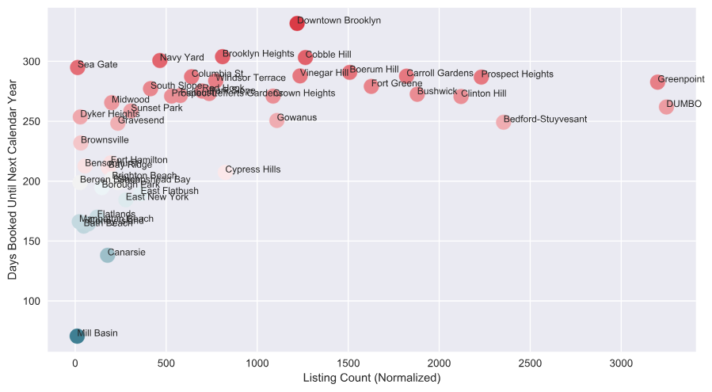
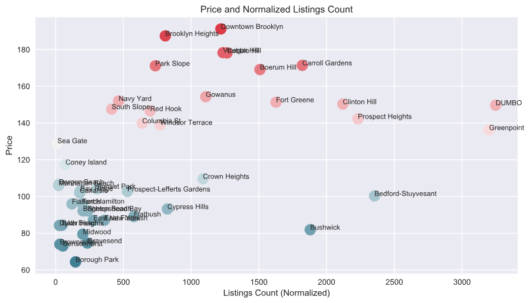
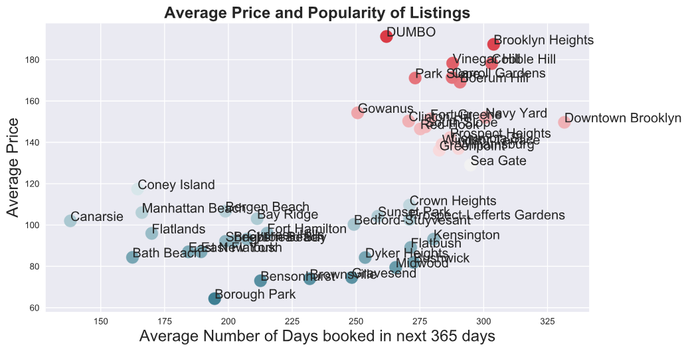
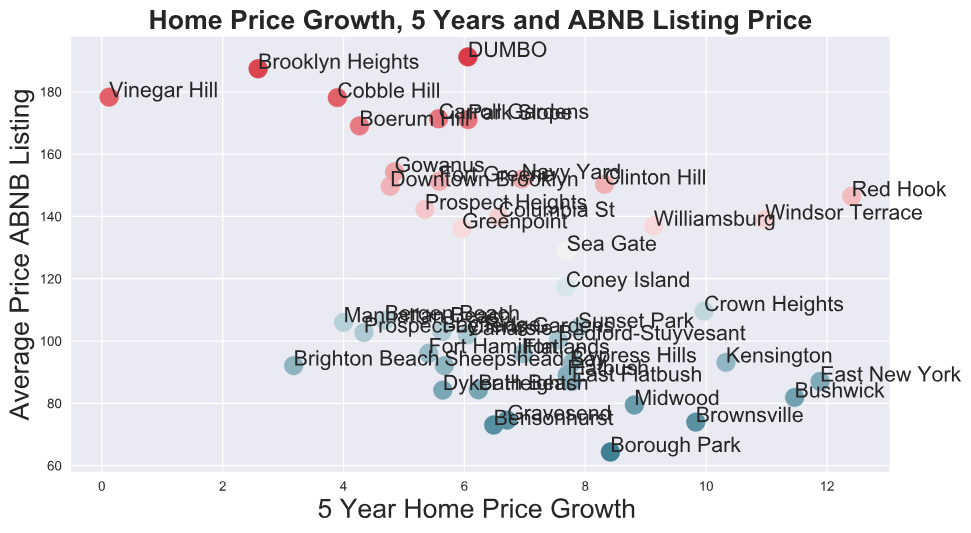
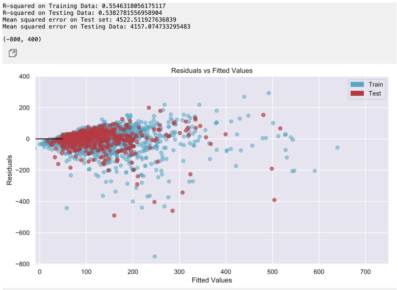
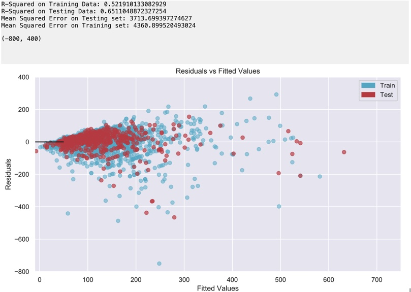
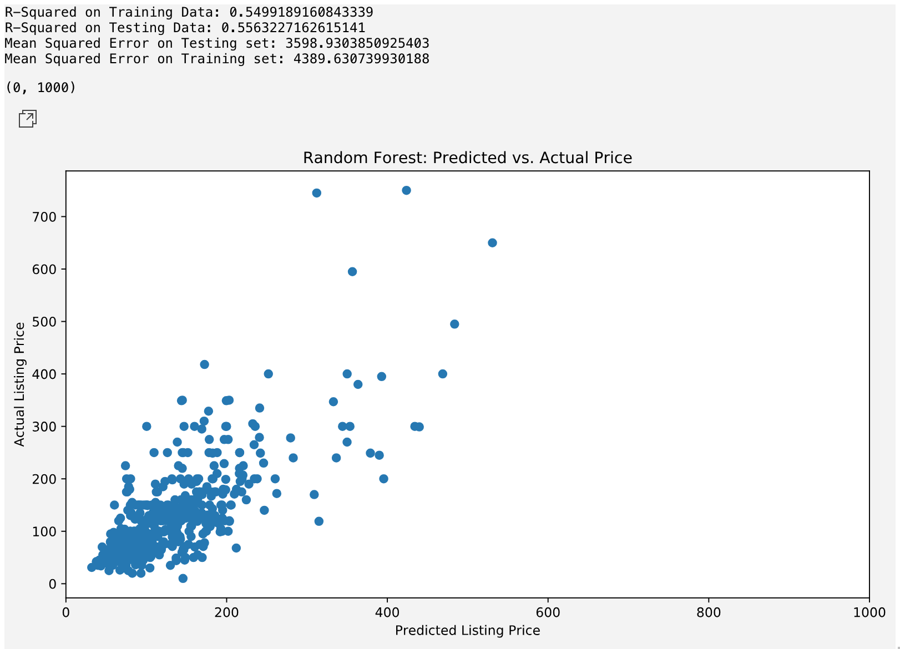

The purpose of this project is to use Airbnb listing data and Zillow value data to provide marketing and business recommendations to Airbnb. This will be achieved through exploratory data analysis and predictive models for Airbnb listing price.

The first part of the project is dedicated to taking visual into Airbnb listings in the Greater New York area to discover trends in listings price, occupation, rating, value, etc. The regions we will primarily focus on will be Brooklyn. This reasons for this is because I personally have an Airbnb listing in the Crown Heights area. We're looking for insights into listing behavior that could help Airbnb make strategic business decisions. The second part of the project introduces the Zillow data and the process of creating a predictive model for listing behavior that uses both data sets.

## **The Data**

Throughout this project, we will be using data from Airbnb and Zillow. The Airbnb data was obtained through the third party platform, Inside Airbnb, which scrapes listing data regularly. All the listing data used in this project is from the July timeframe of 2019. Zillow has its home value index available on its website. We will be using home value data from 2019.

## **Airbnb Data**

We begin by importing and cleaning the raw Airbnb listing data. The columns or features selected to be used in the analysis:

* **ID:** This is a unique identifier for each listing.
* **Room Type:** Defines the layout type of the listing  as either: 'Single Room', 'Shared Room' or 'Entire Home/Apartments'.
* **Accomodates:** The number of people that each listing can accomodate.
* **Bathrooms:** The number of bathrooms in each listing.
* **Bedrooms:** The number of bedrooms in each listing.
* **Availability 365:** The number of days that a listing is available to be booked in the next 365 days.
* **Number of Reviews:** The number of reviews for each listing.
* **Review Score, Accuracy:** This is the average accuracy rating for each listing. The user rates the listing based on how accurate the listing was as compared to the posting online.
* **Review Score, Value:** This is the average value rating for each listing. The user rates the listing based on its value.

## **Exploratory Data Analysis**

We begin by analyzing the listing count in the area. Looking at this normalized data, while it is true that Williamsberg and Bedford-Stuyvasant have a large amount of listings, when divided by the population, we see that the listing count is very dependent on the population. Now there are some more interesting points to extract.

### **Where are the most popularly places to stay?**

Williamsberg and Kensington have the highest normalized listing count. These areas out rank the front-runners of the un-normalized list, Bedford-Stuyvasant and Crown Heights, which follow. 

But what does this normalized listing count actually indicate? This count tells us the number of listings each region would have disregarding the population. In other words, it tells us the number of listings there would be in each region if they all had the same population.

The higher a region ranks in normalized listing count, the more host are listing there homes on the Airbnb website compared to other. Thus, a higher normalized listing count indicates that there is a higher supply of listings in those cities. This high supply mat also suggest that these are areas where the Airbnb market is strong in terms of hosting listings. 

This would also mean that the cities with a lower normalized listing count are ones where Airbnb is not as popular from a supply or host side of the service. In areas such as DUMBO (Down Under the Manhattan Bridge Overpass) and Boerum Hill, there may be some regulation prohitbiting the amount of listings available in these areas.

Let's look at what happens when we pair this 'supply' side data with a parameter that estimates demand. 'Demand' of a listing in the context of this data can be expected by the popularity of the region to visit. This is indicated by the availability of a listing in the next calendar year. Plotting the mean availability (demand indicator) against the normalized listing count (supply indicator), we can explore the relationship. I have removed Williamsburg and Kensington, as they are clearly outliers.

We take our mean availability metric (which measures the average number of days each listing is available to book in the next calendar year) and subtract 365 to get the number of days the average listing is booked in each area. A higher number indicates that the region city is more popular, and therefore, has more 'demand.'

There seems to be a general trend of increasing supply of listings. As the area becomes more popular, we can expect more listings to appear in the area. This implies that Airbnb is doing a relatively good job encouraging individuals to host their homes as listings, given the demand of travel in those cities.

### **Where are the most expensive/cheapest places to stay?**

Mill Basin, DUMBO, and Brooklyn Heights are the most expensive areas to stay in Brooklyn, while Borough Park, Brownsville, and Gravesend are the least expensive. These results are interesting but difficult to explain why the areas fall in the order they do. Is it because of supply and demand? This average price metric is more interesting when we pair it with other data sets and explore relationships.

Price and listing count have an obvious correlation. As the normalized number of listings increase, price increases as well. We run the correlation coefficient between these two variables, we get 0.6154, which is an indication of a strong positive relationship. So as the supply of listings increases, it does not necessarily mean that the increased competition due to increased supply drives down price.

There are places where there is wide dispersion in the price for a similar listing count, and the relationship is not as strong. Fort Greene and Clinton Hill all have normalized listing counts but fall into two distinct price groups. Crown Heights and Cypress Hills have lower average prices. This may be explained by the difference in average size or quality of listings in these two areas compared to the others.

For explain, since Fort Greene and Clinton Hill are larger, host there may live in smaller residences. This limits the number of guests they can accommodate, as well as the bedrooms and bathrooms of their listings, thus driving down the average listing price in these areas. Clinton Hill/Fort Greene is also more commercial than Crown Heights/Cypress Hills, which are more residential.

It's also worth noting that Williamsburg, Kensington are outliers again, along with Mill Basin. As such,
we have removed these three areas for the analysis.

### **Which areas are the most popular to visit and stay?**

There are a few metrics I will use to estiamte the average popularity of listings per area. The first metric I will analyze is the average number of days the listing of a city are booked in the next year. The higher the average number of booked days, the more popular the area's listings are. The most popular travel distinations in Brooklyn are the Brooklyn Heights/Downtown Brooklyn area. This result is not surprising, because they are highly developed areas around the city (Fulton Street Mall, Barclays Center, etc.). 

The second metric we use to determine the popularity of listings in a particular area is the average number of review per city. We use the number of reviews as a proxy for estimating how frequently the listings are booked. The reasonsing is that the more reviews the listing has, the more times it is booked, and therefore, the more popular it is. Here, we are using the average number of reviews for each area's listings.

There are some similiarities in how the areas rank in both metrics. Bedford-Stuyvasant jumps from the bottom of the list on availability to the top on average number of reviews. So although Bed-Stuy is not the most popular place for travelers relative to other areas included in the data set, it is well reviewed, all on average. This may be an indication of the superior value of Bed-Stuy Airbnb listing, or it may be an indication of the relative affordability.

Next, we plot average availability per area versus its average price to get an idea of how popularity and price are related. This time, only Mill Basin is a major outlier with a high price. It is also the most unpopular area to stay, with only 70 days booked in the next calendar year on average. Mill Basin only has 5 listings, according to the most recent analysis by InsideAirbnb. As such, Mill Basin is not meaningful for our analysis.

Since Mill Basin doesn't fit the trend of the rest of data, we drop it from our analysis. After doing so,there is a positive correlation between price and popularity, with a correlation coefficient of 0.582. This coefficient means that, on average, the more popular a listing (higher the number of days booked) the higher the price of the listings. This seems to suggest that areas where it is more popular to travel have higher demand, which drives up price, on average.

## **The Zillow Data**

Unlike commodities and consumer goods, for which we can observe prices in all time periods, we cannot observe prices on the same set of homes in all time periods. This is because not all homes are sold in every time period. Zillow has developed a way of apprioximating the ideal home price index. Instead of actual sale of prices on every home, the index is created from estimated sale prices on every home.

Because of this,the distribution of actual sale prices for homes sold in a given time period looks very similiar to the distribution of estimated sale prices for this same set of homes. But, importantly, Zillow has estimated sale prices, not just for the homes that sold, but for all homes even ig they did not sell in that time period.

### **The Data**

From the Zillow website we have important data on the ZHVI or median home price of every area. This data includes the growth rate of the index over various periods of time including: Month-over-Month, Quarter-over-Quarter, Year-over-Year, the 5-year change and the 10-year change.

### **Airbnb listings and ZHVI Data Relationship**

The average price of a listing seems to increase as the median home value increases, as measured by the Zillow Home Value Index. However, Mill Basin and South Slope are two outliers, with low median home values and high average listing prices. By dropping these two outliers, we increase our correlation coefficient between ZHVI and average list price .341 to 0.494. This confirms that there is a very strong relationship between the median home value and averaqge list price.

## **Machine Learning: Regression Model for Price Prediction**

### **Feature Selection**

We begin by appending all the listing data from these areas into one table. The next step is adding on the appropriate Zillow home value data for each listing based on the zip code for the listing. We will merge the two data sets using the zip code information contained in both data sets. That way, more granular and accurate home value data will be paired to each listing, as opposed to just using the general region name. 

Setting the index to the region name for each data frame and merging on this index, we create a new table such that each listing has its relevant ZHVI 5-Year ZHVI, and 10-Year ZHVI appended to its Airbnb data. This data frame has all of the independent data and dependent data (price) necessary to fit the model. If a linear relationship is not present, some features may require a transformation.

We evaluate linearity by plotting the price of all listings against each feature to ensure it has a linear relationship. The only two variables that needed transforming are the number of reviews and availability. Price exponentially decreases as number of reviews increases. 

After taking the log of the number of reviews, a linear relationship emerges between these variables. With availability, there was an exponential increase in price as the availability increasese. Again, taking the log of availability, a linear relationship emerges between these variables. Also, the sum of all ratings was taken and used as a feature as this variable had a stronger relationship to listing price.

Another requirements in creating a linear model that are indepednent variables, or features, do not have strong relationships with one another, as this violates the assumption of the linear model. To check for this, we use a correlation matrix. 

Relationships between variables are measured between -1 and 1. The higher the absolute number, the stronger the relationship, with the sign signifying the direction of the relationship. As a result of this, bedrooms were removed as a feature, as it had a very strong correlation with bathrooms, occupancy, and ZHVI.

### **Linear Model**

Using the feature DataFrame with all of the chosen independent variables and our dependent variables, price, we split the data into training and testing sets, with 80% of the model used to train the data and 20%  used to evaluate its performance.

It uses the model created by the training data to predict price using the listing features of the testing data. The model then compares this fitted data (or predicted prices) to the actual price of each listing to determine the strength of the model. If the model is strong, then the different between the predicted price on the test data (using the model) for a listing will be very close or exactly the same as the actual price of the listing.

The R-squared is the coefficient of determination and measures, as a percentage, how well our linear model fits the data, or how close the training and test data are to the fitted regression line. In the context of Airbnb data, how well the model will do at predicting the price of a listing based on our selected features.

The R-squared for this initial model was 0.538 for the testing data. This coefficient of determination tells us that the features can explain about 53.8% of the total variance in the price of a listing. At 50%, half of the variability can be attributed to our model. This is reasonable, but we may be able to achieve better results using other alorigthms for linear regression, by changing the number of features or type of areas we include in our model. The performance on the test data was similiar, which is another good sign for the data. The Mean Squared Error for the testing set is 3676, which may be a cause for concern. However, this is something that can be corrected by refitting the model.

We will use mean squared error along with the R-Squared to compare the performance and linear fit to others as we try to improve the model. There is definitely room for improvement, especially with MSE and R-squared.

The residuals vs. fitted plot above described the difference in the actual listing price and predicted listing price using the model. The residuals should be distributed randomly above and below the axis trending to cluster towards the middle without any clear patterns. These qualities are indicative of a good linear model, with a normal distribution. Normality in the residuals is important, as it is an assumption in creating a linear model. The model seems to the heteroskedastic, meaning that the residuals get larger as the prediction moves from large to small.

The model is better at predicting prices for average priced listings at around 3

### **Improving the Model: Predicting Price for Highly Popular Regions**

We may be able to achieve a better prediction model and higher R-squared if we segment the cities by a strong variable such as Availability. The idea is that we will have a higher fit by putting similar listings together, resulting in a stronger relationship. Recall from the exploratory analysis above that the most popular areas are those that have the smallest percent average availability in the next year.

We will segment the "highly popular (more than 250 days booked in the next 365 days) from the rest of the samples of cities. We might be able to predict price better for more popular areas. The highly popular areas we used to fit the new model are: **Downtown Brooklyn, Navy Yard, Cobble Hill, Sea Gate, Brooklyn Heights, Columbia St, Carroll Gardends, Williamsburg, Boerum Hill, Prospect Heights, Greenpoint, Vinegar Hill, Windsor Terrance, South Slope, Kensinton, Park Slope, Fort Greene, Flatbush, Clinton Hill, Prospect-Lefferts Gardens, Bushwick, Crown Heights, Red Hook, Midwood, Sunset Park, DUMO, and Bedford-Stuyvesant.**

This model's coefficient of determination tells us that the linear regression model can explain around 65.1% of the total variance in the price of listing from a popular area. At 65%, almost two-thirds of the variability can be attributed to our features. This is much higher than our original linear model using all areas. This result proves that there is stronger linearity for popular areas in Brooklyn.

### **Random Forest Regression for Popular Areas Model**

Next, we will be using the Random Forest Regression model on our popular cities data to see if it results in a better fitting model. The Random Forest model uses an algorithm which 'bootstraps' (takes of many random samples from the training data) to build the 'nodes' of a decision or regression tree that models the behavior of the data to create a linear model.

After implementing the Random Forest Regression, the fit doesn't improve significantly from the highly popular sample set. The model has an R-square of 55.6%; however, we did manage to reduce the MSE.

## **Conclusion**

The linear regression model reveals some interesting attributes regarding the relationship between price and various characteristics of listings, which can be leveraged to help business strategy for Airbnb.

There is a big difference in the way the appreciation of home values impacts the price of an Airbnb listing over a 5 year and 10-year timeframe. This trend is present in all the models we looked at, but let us use our 'Popular Areas' model as an example here (the second model we created). Net of all other variables, the price of a listing increases 45 dollars for every one-point increase in home value over five years. This is a stark contrast to the -301 variable of the same measure over 10 years. This suggests that as home values increase over a larger period of time, the price of listing value, which spikes supply and drives down prices.

The 10-year figure may not be an accurate way to analyze the listing value, as the real estate market can change dramatically in this time. The 5-year may be a more reasonable indicator. Given that most listings are around 100 dollars a night, the fact that home values can impact the price by 45 dollars seems like a significant variable to investigate.

In terms of listing variables, the size of the listing seems to be one of the biggest influences on the price of a listing. The number of people the listing accommodates the number of bathrooms is some of the largest regression coefficients in the model. This relationship demonstrates how hosts and guests value listings. A away Airbnb can use this data could be a way to control the average price listings in an area. If they want to create more listings at lower prices for certain areas. Airbnb could make host post listings that accommodate fewer people. This relationship suggests that it may be a good next step to segment the data based on the size of listings to determine if they are more relationships to explore.

The model and exploratory analysis conducted in this project provided an exciting look into the behavior of Airbnb listings for popular travel destinations in Brooklyn. However, the model and analysis could be greatly improved upon with data from more cities. Improved correlations between variables and clearer relationships could be established with more listing information from a wider variety of cities. The conclusions established from this analysis would also be more significant. Another expansion of this analysis would be to take it beyond major cities and travel destination in Brooklyn. The data used here does not provide a look into the nature of the Airbnb market in mid/smaller areas of Brooklyn. There could be an untapped market for short-term rentals or local travel in these areas that should be explored.

## **Sources**

[1] Inside Airbnb. Accessed at:
 http://insideairbnb.com/get-the-data.html

[2] Zillow Home Value Index. Accessed at:
 https://www.zillow.com/research/data/

### **GitHub Code**

Full github code with explation [here](https://github.com/Hedgology/Airbnb-Analysis-in-Brooklyn)