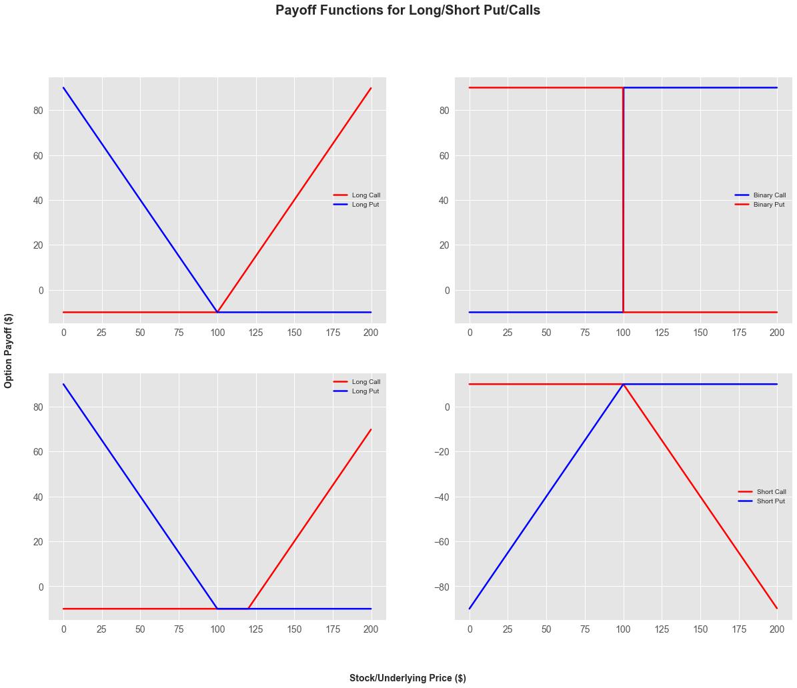
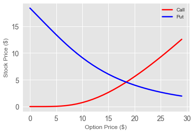
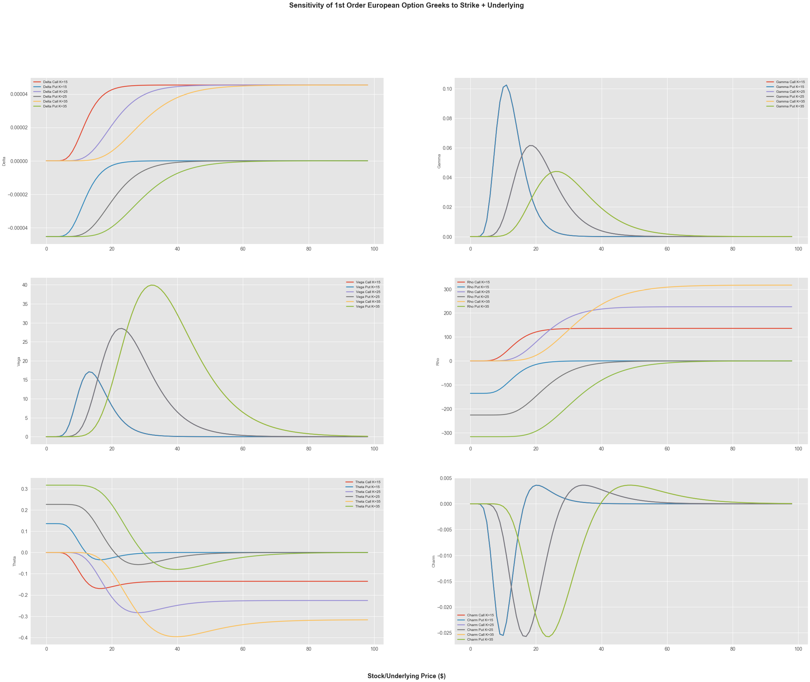
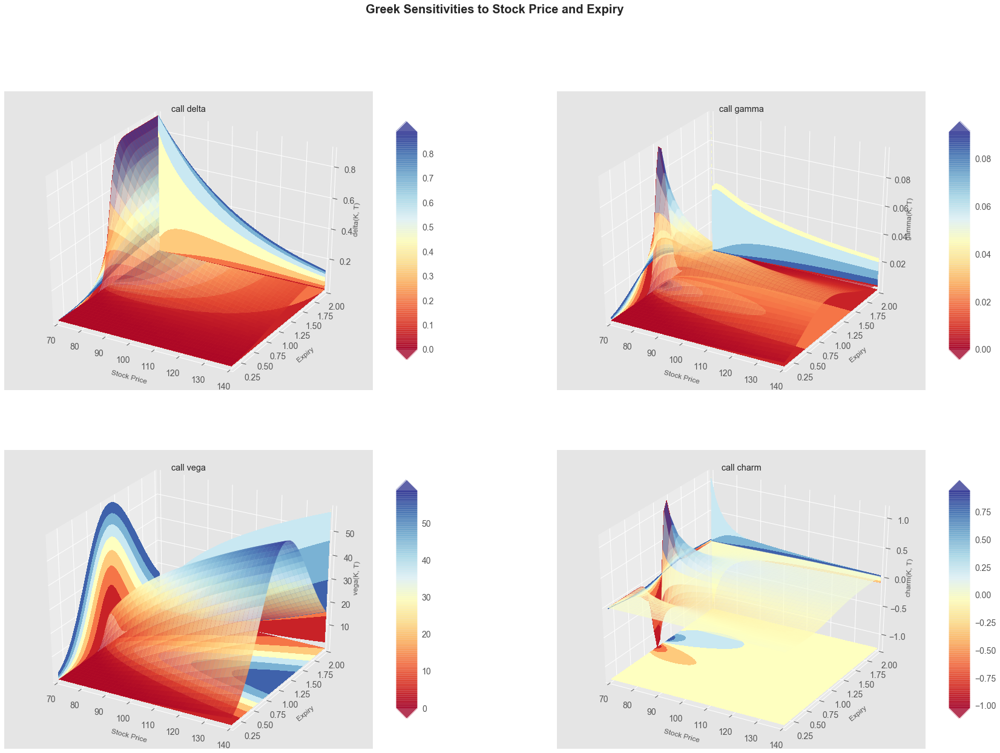

I wanted to get a better understanding of using the Python programming language to play around with options. We'll have a look at creating some option payoff functions, implementation of Black-Scholes pricing, and then finish up with some sensitivity analysis (Greeks).

I'll provide a reasonably high-level overview of what we're doing, but I'm by no means an expert in options! However, I found that by implementing them in the Python programming language is good practice in some fundamental skills like list manipulations, maps, plotting, and taking it one step further into object-oriented programming.

## Black-Scholes Equation

Perhaps the most famous and possibly infamous equation in quantitative finance is the Black-Scholes equation. A partial differential equation, which provides the time-evolving price of a vanilla option, specifically European put and call option here (there are all sorts of extensions which extend the usability of this formula).

$$
\frac{\partial V}{\partial t}+\frac{1}{2}\sigma^{2}S^{2}\frac{\partial V^{2}}{\partial S^{2}}+rS\frac{\partial V}{\partial S}-rV = 0$$

The equation can be solved to yield a fairly simple closed-form solution for an option price for a non-dividend underlying (and a whole bunch of other assumptions such as efficient markets, no transaction cost, etc.).

$$ C(S_{t},t) = N(d_{1})S_{t}-N(d_{2})Ke^{-r(T-t)}$$

The equation can be solved to yield a fairly simple closed-form solution for an option price for a non-dividened underlying (and a whole bunch of other assumptions such as efficient markets, no transaction cost, etc.).

With: 

$d\_{1}  = \frac{1}{\sigma \sqrt{T-t}} \Big[ln\bigg(\frac{S\_{t}}{k}\bigg)+\bigg(r+\frac{\sigma^{2}}{2}\bigg)(T-t) \Big]$

$d\_{2}  = d\_{1} - \sigma \sqrt{T-t}$

The above equation can be interpreted as the call option premium, which is the difference between the expected benefit of purchasing the underlying outright at time $t$ against the present value of purchasing the underlying at the strike price expiration time $T$.

Another way of interpreting the call option premium/option value is through intrinsic value and time value, where the option value is comprised of:

1. The intrinsic value of exercising the option immediately, i.e., what would the payoff be if we exercised

2. The time value of the option derived from the random behavior of the underlying. As the underlying stock is typically modeled as a stochastic process, there is a probabilistic component, which basically means there is some chance that the stock price could move significantly in our favor over time. Thus we would typically expect to pay higher premiums for options with longer maturities

## The Partial Differential Equation

The original derivation of the Black-Scholes partial differential equation was via stochastic calculus, Ito's lemma, and a simple hedging argument. Assume that the underlying follows a lognormal random walk:

$$dS=\mu S dt + \sigma S dX $$

Use $\Pi$ to denote the value of a portfolio of one long option position and a short position in some quantity $\Delta$ of the underlying:

$$\Pi = V(S,t) - \Delta S. $$

The first term on the right is the option and the second term is the short asset position.

We then ask how the value of the portfolio changes from time $t$ to $t + dt$. The change in the portfolio value is due partly to the change in the option value and partlyto the change in the underlying:

$$d\Pi = dV - \Delta dS. $$

From Ito's lemma, we have

$$ d \Pi = \frac{\partial V}{\partial t}dt + \frac{\partial V}{\partial S}dS + \frac{1}{2}\sigma^{2}S^{2}\frac{\partial^{2} V}{\partial S^{2}}dt - \Delta dS. $$

The right-hand side of this contains two types of terms, the deterministic and the random. The deterministic terms are those with the $dt$, and the random terms are those with the $dS$. 

Pretending for moment that we know $V$ and its derivatives, then we know everything about the right-hand side *except for the value of $dS$*, because this is random.

These random terms can be eliminated by choosing

$$\Delta = \frac{\partial V}{\partial S}.  $$

After choosing the quantity $\Delta$, we hold a portfolio whose value changes by the amount 

$$d \Pi = \bigg(\frac{\partial V}{\partial t} + \frac{1}{2}\sigma^{2}S^{2}\frac{\partial^{2} V}{\partial S^{2}}\bigg)dt.$$

This change is completely *riskless*. If we have a completely risk-free change $d\Pi$ in the portfolio value $\Pi$, then it must be the same as the growth we would get if we put the equivalent amount of cash in a risk-free interest-bearing account:

$$d\Pi = r\Pi dt. $$

This is an example of the no arbitrage prinicple. Putting all of the above together to eliminate $\Pi$ and $\Delta$ in favor of partial derivatives of $V$ gives us the Black-Scholes Equation:

$$
\frac{\partial V}{\partial t}+\frac{1}{2}\sigma^{2}S^{2}\frac{\partial V^{2}}{\partial S^{2}}+rS\frac{\partial V}{\partial S}-rV = 0$$

Solving this simple linear diffusion equation with the final condition and you'll get the following Black-Scholes call option formula.

This derivation of the Black-Scholes equation is perhaps the most useful it is readily generalizable (if not necessarily still analytically tractable) to different underlyings more complicated models, and exotic contracts. 

## Implementation of Formula

### Payoff Functions

Payoff functions are key to understanding the profit (and loss) that we'll receieve upon purchasing an option or options. They are typically designed so that you can view the strike price on the purhcased (or sold) option, as a function of the underlying's price.

For now, we'll only plot some basic options and option strategies, without doing any calculations of the option prices. The option price will simply be a parameter, which we feed into the payoff functions.

Later, we'll return and price a European option using the above Black-Scholes method, and this will allow us to build out some more complex option strategies payoff functions with varying maturities.

Basic Concepts/Defintions:

* **In-the-money (ITM):** An option is ITM if it is currently "worth" exercising today. For example, for a call option, the current underlying's price is greater than the strike price (and vice versa for a put).
* **Out-of-the-money (OTM):** An option that is OTM if it is currently "not worth" exercising today.
* **At-the-money (ATM):** An option is ATM if it is neither ITM or OTM, i.e. exercising today would have no tangible effect (ignoring any transaction cost/option premiums).
* **Strike Price:** This is the price at which our option is exercised.
* **Underlying:** This refers to the asset (which could really be anything which has a price) which underlies the derviative contract.

We will first begin by importing the necessary modules. This project won't require anything too advanced or complicated; Pandas, Numpy, and Matplotlib will do.

The following code will also set the parameters for the tick size for the x and y axes, the title size/weight, as well as the line width. This is for the purposes of uniformity.

```python
import pandas as pd
import matplotlib.pyplot as plt
import numpy as np
plt.style.use('ggplot')
plt.rcParams['xtick.labelsize'] = 14
plt.rcParams['ytick.labelsize'] = 14
plt.rcParams['figure.titlesize'] = 18
plt.rcParams['figure.titleweight'] = 'medium'
plt.rcParams['lines.linewidth'] = 2.5
```

We'll begin by making a function that allows us to calculate the payoff for a call option.

$$ V(S,T) = max(S - K, 0)$$

The following equation states that the payoff for a call option is:

* 1) the difference between the underlying stock price and the strike price or 
* 2) nothing

For a call option, our downside is limited, while our upside is unlimited. However, just because the downside is limited doesn't mean that there is zero cost. We still need to consider the cost of the option, which is known as the premium.

Considering these factors, we can define the profit of an option strategy as follows:

$$ Profit = Max(S - K, 0) - Price.$$

So the maximum downside in this case will always be the premium paid for the option.

### Long Calls and Puts

We will begin by writing functions for **long calls and puts**. Many people get confused by the term "long;" suggesting that (similiar to equities) in order to profit from these instruments the underlying would need to increase in value. 

This is only true in the case of the long call, were we would only elect to call if the current stock price is greater than the strike price on our option. In the case of a long put, we would only call if the current stock price is *less* than the strike price on our option.

As such, the payoff from a long put would be the following:

$$V(S,T) = Max(K - S, 0) $$

Our first two functions are as follows:

```python
# S = underlying stock
# K = strike price
# Price = premium paid for option

def long_call(S, K, Price):
  # defining the function; listing the arguments as follows
  
  P = list(map(lambda x: max(x - K, 0) - Price, S))
  # Creates a throw-away function that calculates the payoff of the call,
  # then iterates through an array and converting the array to a list
  # the final result is assigned to the value 'P'.
  
  return P
  
def long_put(S, K, Price):
  
  P = list(map(lambda x: max(K - x, 0) - Price, S))
  return P
```

### Short Calls and Puts

Next, we'll start writing functions for **short calls and puts**. Rather than getting down into the details of payoffs formulas and profit mechanisms, you can think of short calls/puts as the inverse as long calls/puts.

Considering these factors, we won't really need to do very much for when creating these types of functions (for the most part).

```python
#Creating the funcitons for Short Calls/Puts

def short_call(S, K, Price):
    
    P = long_call(S, K, Price)
    # Since the Payoff a shortcall is just the inverse of the payoff of a long call,
    # we can use the long_call function
    
    return [-1.0*p for p in P]
    # Simply multiple each iteration by -1 

def short_put(S,K, Price):

    P = long_put(S,K, Price)
    return [-1.0*p for p in P]
```

### Binary Options

Binary options are a form of exotic options, in which the payoff is either a fixed monetary amount or nothing (all-or-nothing). The formula for a long binary option is as follows:

$$V(S,T) = \begin{cases} 1 & | & \text{if} & S > K, \\
0 & | & \text{if} & K < S. \end{cases}$$

The formula is revesed when considering short binary options, as well.

```python
def binary_call(S, K, Price):
    
    P = list(map(lambda x:  K - Price if x > K else 0 - Price, S))
    # created a function that substracts K from the Price if an array
    # of prices is greater than K. Otherwise, the payoff will be the
    # cost of the option

    return P

def binary_put(S,K, Price):
    
    P = list(map(lambda x:  K - Price if x < K else 0 - Price, S))
    return P
```

We first initially created a list of stock prices using the list comprehension in python. Our range considers underlying prices from 0 to 200. Then we can then plot the payoffs for each options strategy on one image. We listed our strike price, $K$, of 100 and a premium, $P$, of 10.

Each plot will have its long and short counterparts, respectively. The x-axis list potential range of underlying price, while the y-axis lists the potential range of option payoffs.



As one can see, with a long call, the minimum loss will never be greater than 10 dollars. With a strike of 100 dollars, the underlying would need to go north of 110 dollars for you to make a profit. This is known as the "break-even" point. The inverse is true for long puts, as profit increases when the underlying decreases in value.

You may notice that the payoffs for short options are negative. As stated previously, they're the inverse of long calls/puts. There is limited upside, the unlimited downside (although, the underlying can't go any lower than $0).

With these factors, why would anyone invest in short options? That's because profit-making opportunities are all based on the investors perspective on underlying direction and volatility.

We won't get into particular options trading strategies here. The purpose here is to explore the Black-Scholes framework and the sensitivities related to option characteristics.

## Options Payoff Using Black-Scholes

We can implement the equations we defined previously, to help us 
calculate the premium of an option, as well as the sensitivities of these equations to the various parameters using Black-Scholes.

Recall the Black-Scholes formula for a call option as before. We need to create a function for Black-Scholes formula, $d\_{1}$ and $d\_{2}$.

```python
from scipy.stats import norm

# S: underlying stock price
# K: Option strike price
# r: risk free rate
# D: dividend value
# vol: Volatility
# T: time to expiry (assumed that we're measuring from t=0 to T)

def d1_calc(S, K, r, vol, T, t):
    # Calculates d1 in the BSM equation
    return (np.log(S/K) + (r + 0.5 * vol**2)*(T-t))/(vol*np.sqrt(T-t))

def BS_call(S, K, r, vol, T, t):
    d1 = d1_calc(S, K, r, vol, T, t)
    d2 = d1 - vol * np.sqrt(T)
    return S * norm.cdf(d1) - K * np.exp(-r*T)*norm.cdf(d2)
```
We also need to estbalish a formula that can be used on puts and binary options. The formula for puts are as follows:

$$P(S, t) = Se^{-D(T-t)N(d_{1})}-Ke^{-r(T-t)}N(d_{s}).$$

```python
def BS_put(S, K, r, vol, T, t):
    return BS_call(S, K, r, vol, T, t) - S + np.exp(-r*(T-t))*K
```

We can now examine the potential payoff based on the Black-Scholes formula. We'll create a stock range from 0 to 30. We can assume that our strike is 50; our risk-free rate will be 10%, expected volatility will be 20%; the time to expiry will be 10 (t = 0; T = 10).



As you saw from the plots we've previously made, there was a linear relationship, as the only variables we considered was the payoff and the premium. Using BSM, there are more variables to consider; therefore, there is a curvature with the following models.

With a strike price of 50, our put will have the highest value to us when the stock is worth 0 dollars. We would purchase the stock at 0 dollars, then exercise our put option to sell for 50 dollars.

A call is the opposite, our option to buy is worth the least if the stock price is 0 and will increase in value as the stock price increases.

### The Greeks

The 'greeks' are the sensitivities of derivative prices of underlying, variables, and parameters. They can be calculated by differentiating option values with respect to variables and/or parameters, either analytically, if you have a closed-form formula, or numerically.

We can implement the equations we defined previously, to help us 
calculate the premium of an option, as well as the sensitivities of these equations to the various parameters.

#### Delta

The delta, $\Delta$, of an option or a portfolio of options is the sensitivity of the option or portfolio to the underlying. It is the rate of change of value with respect to the asset:

$$ \Delta = \frac{\partial V}{\partial S}.$$

Typically, the delta changes as the stock price and time change. So, to maintain a delta-neutral position, the number of assets held requires continual readjustment by purchase or sale of the stock. This is called **rebalancing** the portfolio, and is an example of **dynamic hedging**.

```python
def delta(S, K, r, vol, T, t, otype):
    d1 = d1_calc(S, K, r, vol, T, t)
    d2 = d1 - vol * np.sqrt(T-t)
    
    if(otype == "call"):
        delta = np.exp(-(T-t))*norm.cdf(d1)
    elif(otype == "put"):
        delta = -np.exp(-(T-t))*norm.cdf(-d1)

    return delta
```

#### Gamma

The gamma, $\Gamma $, of an option or a portfolio of options is the second derivative of the position with respect to the underlying:

$$\Gamma = \frac{\partial^{2} V}{\partial S^{2}}.$$

Since gamma is the sensitivity of the delta to the underlying, it measures how much (or often) a position must be re-hedged in order to maintain a delta-neutral position. If there are costs associated with buying or selling a stock, the bid-offer spread, for example, then the larger the gamma, the larger the cost or friction caused by dynamic hedging.

```python
def gamma(S, K, r, vol, T, t, otype):
    d1 = d1_calc(S, K, r, vol, T, t)
    gamma = (norm.pdf(d1)) / (S * vol * np.sqrt(T-t))
    
    return gamma
```

#### Theta

The theta, $\Theta$, is the rate of change of the option price with time.

$$\Theta = \frac{\partial V}{\partial t}.$$

The theta is related to the option value, the delta and gamma by the Black-Scholes equation.

#### Vega

The vega, $\nu$, is a very important, but confusing quantity. It is the sensitivity of the option price to volatility.

$$\nu = \frac{\partial V}{\partial \sigma}.$$

The is completely different from the other greeks since it is a derivative with respect to a *parameter* and not a *variable*. This can be important. It is perfectly acceptable to consider sensitivity to a variable, which does vary, after all. However, it can be dangerous to measure sensitivity to something, such as volatility, which is a parameter and may, for example, have been assumed to be constant. That would be internally inconsistent.

```python
def vega(S, K, r, vol, T, t, otype):
    d1 = d1_calc(S, K, r, vol, T, t)
    return S * norm.pdf(d1) * np.sqrt(T-t)
```

#### Rho

Rho, $\rho$, is the sensitivity of the option value to the interest rate used in the Black-Scholes formula:

$$\rho = \frac{\partial V}{\partial r}.$$

In practice, one often uses a whole term structure of interest rates, meaning a time-dependent rate of $r(t)$. Rho would then be the sensitivity to the level of the rates, assuming a parallel shift in rates at all times.

Rho can also be sensitivity to dividend yield or foreign interest rate in a foreign exchange option.

```python
def rho(S, K, r, vol, T, t, otype):
    d1 = d1_calc(S, K, r, vol, T, t)
    d2 = d1 - vol*np.sqrt(T-t)
    
    if(otype == "call"):
        rho = K*(T-t)*np.exp(-r*(T-t))*norm.cdf(d2)
    elif(otype == "put"):
        rho = -K*(T-t)*np.exp(-r*(T-t))*norm.cdf(-d2)
    return rho
```

#### Charm

The charm is the sensitivity of delta to time.

$$Charm = \frac{\partial^{2} V}{\partial S \partial t}.$$

This is useful foreseeing how your hedge position will change with time,for example, up until the next time you expect to hedge. This can be important near expiration.

```python
def charm(S, K, r, vol, T, t, otype):
    d1 = d1_calc(S, K, r, vol, T, t)
    d2 = d1 - vol*np.sqrt(T-t)
    charm = -norm.pdf(d1)*(2*r*(T-t) - d2*vol*np.sqrt(T-t))/(2*(T-t)*vol*np.sqrt(T-t))

    return charm
```

We will first plot the sensitivity of the first order european option greeks relative to their strike price for both calls and puts. We'll use a risk-free interest rate of 1%; expected volatility of 10%, and time to expiration of 10 (t=0; T=10).

To illustrate a certain point when it comes to sensitivity, we will choose three different strike prices: 15, 25, 35. With these parameters, we're able to plot the following plot chart.



Plenty of interseting movements and factors illustrated within these plots; however, I want to focus on delta, gamma, and vega.

As mentioned before, the delta is the sensitivity to the option's value relative to its stock price. We can see, in regards to the delta, exhibit different behavior when the underlying changes. However, that change depends on the type of option. As the first subplot shows, there is only so much a call/put's delta can change. 

At a price of 0 dollars, a call's delta is 0, while any price above 20 dollars makes a put's delta 0. This should make intuitive sense, as option calls/puts become worthless the further away they are from their strike prices.

In terms of gamma (delta's sensitivity concerning the underlying), the highest levels of the greek changes around the 15, 25, and 35 dollar strike prices. This implies the closer an option is to the strike price, the more an investor would need to re-hedge in order to maintain what is known as a delta-neutral position.

### Greek Surfaces

So far, we've only been looking at the relationship of one variable:  the underlying. How can we look at the dependence of option prices/greeks on two variables at once? This can easily be done using matplotlib.

In order to create the plot, we needed to generate a range of all of our variables within the BSM. The range of our variables are as follows:

* Underlying Stock: 70 - 140
* Strike Price: 105
* Time to Expiration: 2 (which is really 8) 
* Interest Rates: 0 percent
* Volatility: 12 percent



We have four subplots: delta, gamma, vega, and charm. Within each subplot, we have three axes. The x-axis represents the price of the underlying; the y-axis represents the time to expiration; and the z-axis represents greek. This plot will examine the relationship using calls.

Given the BSM variables we have chosen, a call option will have the highest delta with an underlying of 70 and when the option is close to expiry. Gamma, on the other hand, has the highest sensitivity when the option is halfway close to expiry, with a low underlying.

Vega operates in a very interesting fashion; whereas the sensitivity to Vega increases when the underlying is higher (at 140) and the time to expiration is halfway. Charm also has an interesting relationship with the other variables. Charm is the only greek variable that we have plotted where the z-axis can become negative. 

### Github Code

Click here for the full [github code](https://github.com/SocraticallyStephanie/Quant-Finance/blob/main/Tutorials/Option%20Payoffs%2C%20Black-Scholes%2C%20and%20the%20Greeks.ipynb) and explaionations.